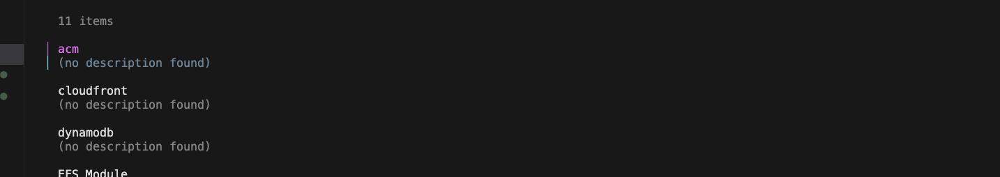

# Catalog Scaffolding

The `terragrunt catalog` command provides an interactive way to browse available units and stacks from your catalog and scaffold new deployments.

## Browsing the Catalog

Run from your live repository (where `root.hcl` with a `catalog` block exists):

```bash
# Launch interactive catalog browser
terragrunt catalog
```

This displays all available units and stacks from the configured catalog.



## Redesigned Catalog (Terragrunt 1.1+)

Since 1.1, `terragrunt catalog` discovers components in the background without upfront configuration:

- **Discovery beyond `modules/`** — units, stacks, and modules are found anywhere in catalog repos; components get type labels and README-derived tags
- **`.terragrunt-catalog-ignore`** — commit to a catalog repo to control what gets indexed (gitignore-style rules)
- **`--ignore-file <path>`** (or `TG_IGNORE_FILE`) — layer extra ignore rules on top of the repo's file; last match wins, so it can add exclusions or re-include excluded paths
- **`--no-discovery-auth-provider-cmd`** — skip auth provider invocations during discovery; noticeably faster on large repos
- **Scaffold form** — press `s` on a selected component to open an interactive form with field validation for boilerplate variables
- **CAS-backed cloning** — catalog repos clone through the [CAS](cas.md) by default; repeat browses are near-instant

## Catalog Configuration in root.hcl

```hcl
catalog {
  urls = [
    "git@github.com:YOUR_ORG/infrastructure-catalog.git",
    "git@github.com:YOUR_ORG/infrastructure-aws-catalog.git"  # Multiple catalogs supported
  ]
}
```

## Using Boilerplate for Scaffolding

When you select a unit or stack from the catalog, Terragrunt uses [Boilerplate](https://github.com/gruntwork-io/boilerplate) to scaffold the configuration. Units and stacks can include a `boilerplate.yml` to prompt for required values:

```yaml
# units/rds/boilerplate.yml
variables:
  - name: name
    description: "Name of the RDS instance"
    type: string

  - name: environment
    description: "Environment (dev, staging, prod)"
    type: string
    default: "dev"

  - name: instance_class
    description: "RDS instance class"
    type: string
    default: "db.t3.medium"

  - name: version
    description: "Module version to use"
    type: string
    default: "v1.0.0"
```

## Scaffold a New Deployment

```bash
# Navigate to target directory
cd non-prod/us-east-1/staging/my-service

# Browse and scaffold from catalog
terragrunt catalog

# Or scaffold directly by URL
terragrunt scaffold git@github.com:YOUR_ORG/infrastructure-catalog.git//units/rds
```

## Boilerplate Templates

The boilerplate template generates the final terragrunt.hcl:

```hcl
# modules/rds/.boilerplate/terragrunt.hcl
terraform {
  source = "git::git@github.com:YOUR_ORG/modules/rds.git//app?ref={{ .ModuleVersion }}"
}

inputs = {
  name           = "{{ .Name }}"
  environment    = "{{ .Environment }}"
  instance_class = "{{ .InstanceClass }}"
}
```

## Scaffold Directory Structure

When scaffolding, Terragrunt:
1. Clones the catalog repository (if not cached)
2. Presents available units/stacks for selection
3. Prompts for boilerplate variables
4. Generates terragrunt.hcl in the current directory

## References

- [Terragrunt Catalog Documentation](https://docs.terragrunt.com/features/catalog/)
- [Boilerplate Documentation](https://github.com/gruntwork-io/boilerplate)
