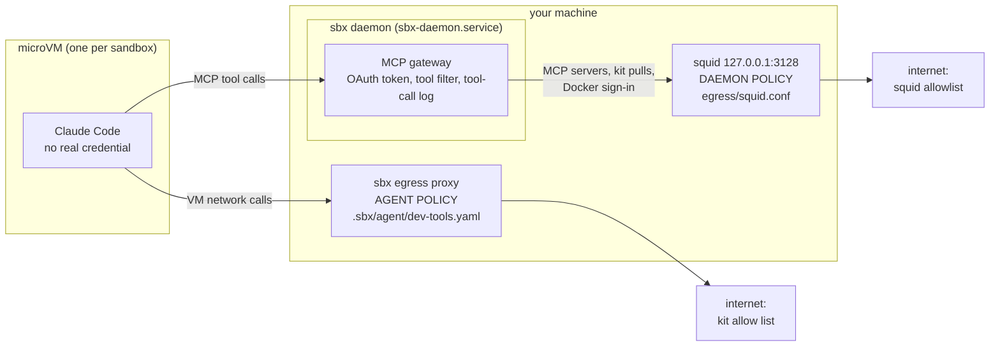
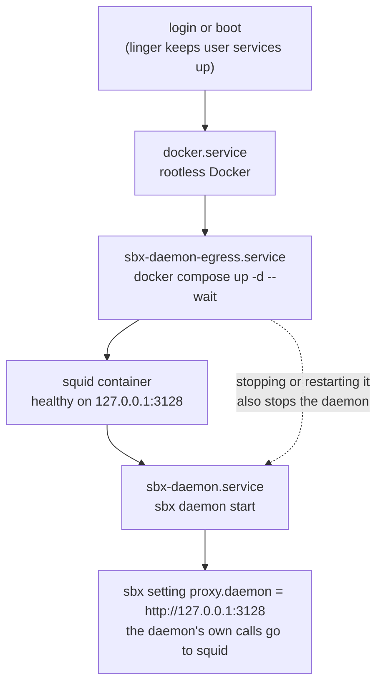

# The sbx daemon, and what keeps it on a short leash

The sandbox is a VM, but the VM does not make every network call itself. The **sbx daemon** runs on your machine, outside the VM, and makes the MCP calls, kit pulls
and Docker sign-in for it. The VM's egress rules do not cover those calls, so they go through a small squid proxy with an allowlist, and systemd keeps both running.

## Where it sits



## How it starts



## Files

| File | What it is |
|---|---|
| `Taskfile.yml` | `sandbox:install-daemon` (once per machine; its comments hold the steps, checks, logs and undo) and `sandbox:install-mcp` |
| `systemd/sbx-daemon-egress.service` | starts the squid container and keeps it running |
| `systemd/sbx-daemon.service` | runs the sbx daemon, ordered after the proxy |
| `egress/compose.yaml` | the squid container, listening on `127.0.0.1:3128` only |
| `egress/squid.conf` | the allowlist: the file to edit to let the daemon reach another host |

## Install

```shell
task sandbox:install-daemon     # restarts the sbx daemon, which ends running sandboxes
```
