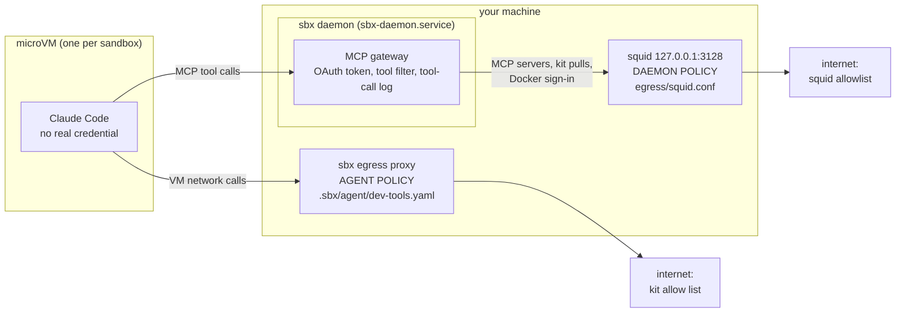
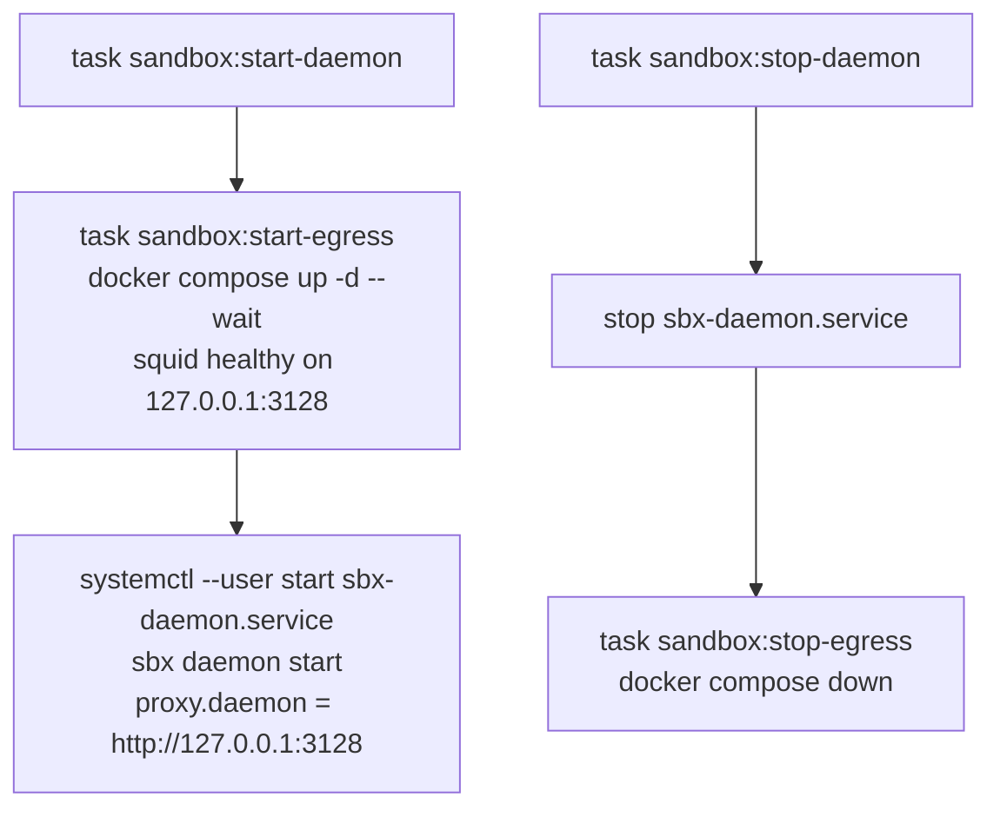

# The sbx daemon, and what keeps it on a short leash

The sandbox is a VM, but the VM does not make every network call itself. The **sbx daemon** runs on your machine, outside the VM, and makes the MCP calls, kit pulls
and Docker sign-in for it. The VM's egress rules do not cover those calls, so they go through a small squid proxy with an allowlist. Two separate things run it:
systemd keeps the daemon up, and a Docker container is the proxy. Tasks start them in order.

## Where it sits



## How it starts



At login, linger starts `sbx-daemon.service` (after Docker), and Docker restarts the squid container because of `restart: unless-stopped`. Nothing orders the two
at login: the daemon can come up a few seconds before squid is healthy. After a `sandbox:stop-daemon` the container is gone, so run `sandbox:start-daemon` (not
a reboot) to bring both back.

## Files

| File | What it is |
|---|---|
| `Taskfile.yml` | `sandbox:install-daemon` (once per machine; its comments hold the steps, checks and undo), `sandbox:start-daemon`, `sandbox:stop-daemon`, `sandbox:restart-daemon` and `sandbox:install-mcp` |
| `systemd/sbx-daemon.service` | runs the sbx daemon, supervised and restarted on failure |
| `egress/Taskfile.yml` | `sandbox:install-egress`, `sandbox:start-egress`, `sandbox:stop-egress` for the proxy container |
| `egress/compose.yaml` | the squid container, listening on `127.0.0.1:3128` only |
| `egress/squid.conf` | the allowlist: the file to edit to let the daemon reach another host |

## Install

sbx comes from mise (`mise install`); the daemon unit runs it from the mise install dir.

```shell
task sandbox:install-egress     # once per machine: pulls the squid image
task sandbox:install-daemon     # once per machine, and after editing the unit: copies and enables it, sets proxy.daemon. Starts nothing
task sandbox:start-daemon       # starts the proxy, then the daemon; prints the journal if the daemon does not stay up
task sandbox:stop-daemon        # stops the daemon, then the proxy. Ends running sandboxes
task sandbox:restart-daemon     # stop then start, e.g. after editing squid.conf
```

If the daemon will not start, the reason is in `journalctl --user -u sbx-daemon.service`, not in `docker logs sbx-daemon-egress` (squid only).
The unit runs `sbx daemon start` in the foreground so systemd can supervise it; `--detach` would make it exit and the unit stop.
