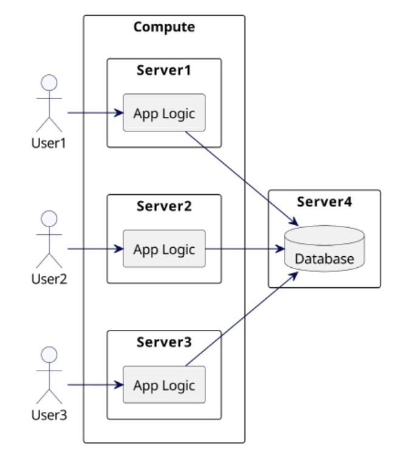
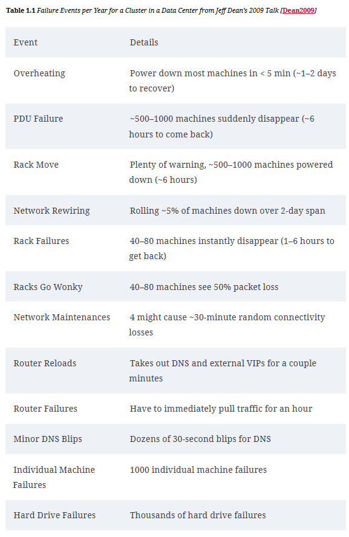

- # Promise and Perils of Distributed systems
	- Limits of a single server
		- Consider a typical retail systems with increasing user base , as the number of requests increases, the performance of the system is determined by 4 resources: network, disk, CPU and memory
		- In a single server system, if its serving 1KB read/write on 1Gbps(125Mbps) connection, this would result in 125000 requests/second, the same would go down to 25,000 requests if the size of the data increases to 25KB
		- Sequential operations to a disk perform better than random ones and concurrent operations affect the performance and this results in queuing. Similarly, CPU and memory get constrained on a single server
		- In order properly server the increasing user base, we need to divide the process into multiple servers. This enables efficient utilization of CPU, memory, network and disk to handle the requests.

	- Separate business login and Data layer
		- In this there is a stateless component responsible for exposing functionality to end users like a web API and second one is a database as the data layer
		- In this way business logic executes in a separate server as compared to the database. However, as requests increase, more servers are added to handle business logic as show below
			- 
		- This approach is effect , however if database grows to petabytes of data, the number of requests to the database layer increases significantly.
    
	- Partitioning Data
		- To solve this, database is partitioned into multiple servers, however they pose a unique set of problems
			- 

	- Failures
		- Suppose a disk has probability of 1/1000 failure, however the chance of failure considerably increases when you have 1000s of disk, a nice data from Google Data center from 2009 is as follows:
			- 
		- When we are working with stateless part of the architecture, failure can be handled easily by adding more servers, however this becomes complex when you are dealing with stateful data such that user is having a seamless experience and not observing any glitch (no stale or incorrect data seen)
		- This means, just distributing data across multiple nodes is not enough, we need to effectively mask the failures

	- Replication: Masking Failures
		- If data is replicated on multiple machines, in the event of failure, client can connect to a server that holds the copy of the data. However, its not as simple as it sounds, some problems observed on this front are as follows:
		- Process Crash:
			- If a process crashed for any particular reason, measures need to be in place to ensure same data is served on restart -> data integrity and availability
		- Network Delay:
			- In case of network delay, we need to be able to determine how long to wait for responses from other process, if a response is not recieved, they need to retry or consider a process has failure.
		- Process Pause:
			- Process execution can also pause at any given moment. In this scenario, other processes depending on can assume, the process has failed and after the pause, when the process resumes and starts sending messages, the other process need to solve the dilemma of whether to process them when they are marked as failed
		- Unsynchronized Clocks:
			- The clocks in servers use quartz crystals, however due to varied factors in a data center, these clocks have clock skew resulting in different times on different servers, although NTP is present to have time synced, however in case of network failures, clocks can remain unsynchronized. So even system timestamps are unreliable during such situations.
		
	- Defining Distributed System
		- A distributed system in software architecture consists of multiple interconnected nodes serving to achieve a common goal. These nodes communicate over a network and coordinate their actions to provide a unified and scalable compute environment.