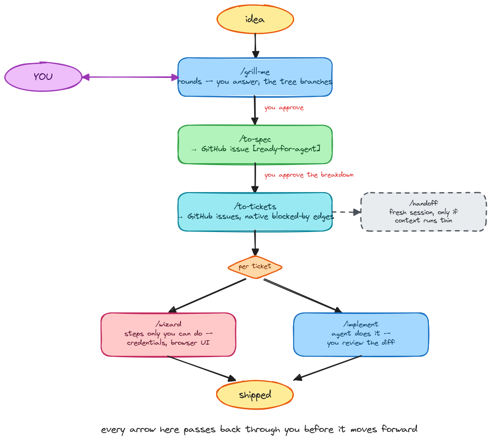
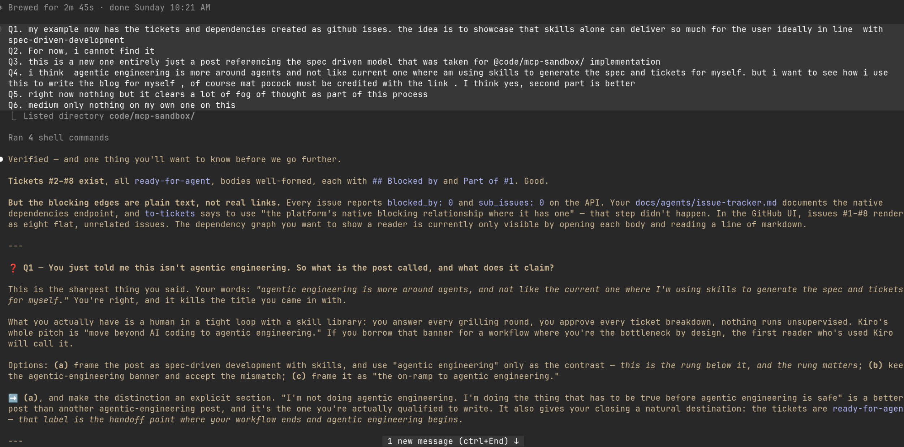
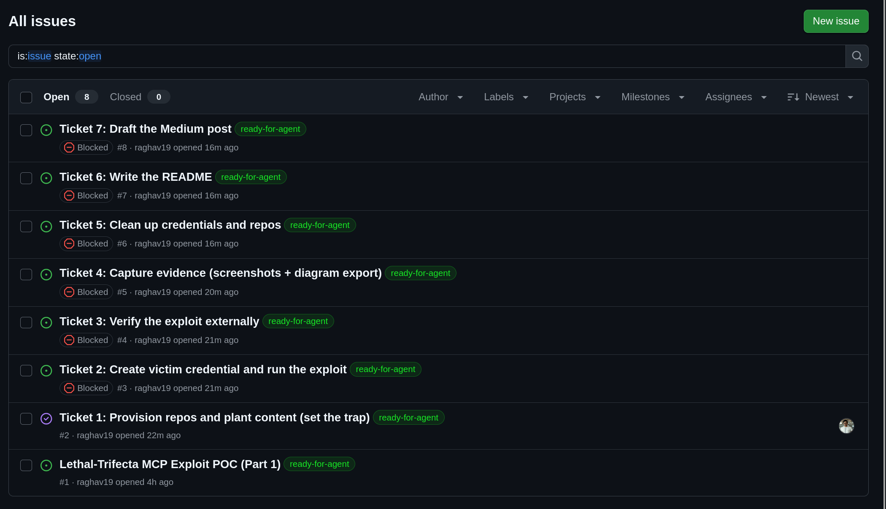

## how i went from idea to ship without writing a line of spec myself

---

for a long time my loop with an ai coding agent looked the same no matter what i was building: drop into plan mode, sketch something out, start building, and figure the rest out as i went, before switching to agent mode to actually ship it.

it works, right up until it doesn't. the annoying part was never the code. it was that nothing forced me to write down what i actually wanted *before* the agent started moving. scope drifted mid-session. decisions i'd made a few prompts earlier would quietly get reopened. and when a session ran long enough that i had to start a new one, whatever was in my head about "why" didn't come with it.

what changed this for me wasn't a smarter model. it was four skills, used in a fixed order, that make a spec exist before any implementation does.

## the workflow

`grill-me → to-spec → to-tickets`, then `/wizard` or `/implement` picks up each ticket depending on whether it's work only i can do, or work the agent can do:

- **`/grill-me`** interviews me about the idea, one question at a time, until nothing's left unclear, i answer every round, the interview only goes where i send it
- **`/to-spec`** takes that conversation and writes it up as a proper spec, problem, solution, what i want, what i decided, what's deliberately left out, i approve it before it goes anywhere
- **`/to-tickets`** breaks the spec into small pieces of work, each one saying what has to finish before it can start, published as linked github issues, i approve the breakdown before it's published
- **`/handoff`** isn't a step in this list, it's a side door — whenever context runs thin, right after tickets are made or mid-way through building one, it hands the work to a fresh session without losing the "why"
- for each ticket, i pick **`/wizard`** for steps that are genuinely human-only — credentials, clicking through a website, anything that can't be scripted — or **`/implement`** for the parts the agent can just do, which i then review

every arrow in that diagram passes back through me before it moves to the next box. that's not an accident, and it's the part i actually want to talk about.

*a quick note on the model — i run the grilling and spec stages on opus 5 with high reasoning effort, since that's the stage where the quality of the questions decides the quality of everything downstream. sonnet 5 handles ticket-level implementation and wizard steps just fine, and it's what finished writing this very post.*

## steering the conversation matters more than answering it

`/grill-me` doesn't just ask questions, it recommends an answer for each one. the easy thing to do is accept the recommendation and move on. the workflow only pays off when i don't.

case in point: i first described this piece as being about "agentic engineering." the interview ran with that and started asking questions built on top of it. i stopped and pushed back — what i'm actually doing here is a lot more hands-on than that term implies. that one correction changed the shape of the whole post, right down to the closing section below. if i'd taken the first framing at face value, this would be a different, weaker post, making a claim i can't actually back up.

the same thing happened earlier, on the security spec this workflow also produced. my first instinct was to assume five categories from a security checklist applied to the exploit i'd built. the review step didn't just ask me to confirm that guess, it made me check it against the actual source text — and two of the five didn't hold up.

that's the part of this workflow that doesn't show up in the diagram: the questions are a starting point, not the destination. the value is in redirecting them when they're wrong, not in answering them quickly.

## what it looked like for real

i ran all of this on a security proof-of-concept i wanted to build for this blog, a live exploit demo against a known mcp security pattern (`code/mcp-sandbox` in this repo, if you want the full thing). i won't retell that project here, this post is about the process that produced it, not the exploit itself.

the short version: one grilling session produced a single spec, published as [a github issue](https://github.com/raghav19/engineersdaybook/issues/1). `/to-tickets` broke that into seven pieces of work, each with a real dependency on the one before it — not just a note in the description, but a link github itself understands, so the graph actually renders:

nobody drew that graph by hand. it came out of the spec.

each of those seven tickets then went through `/wizard` or `/implement`, whichever fit the step, until every one closed. that's the "ship" in this post's title — not just a spec and a ticket graph sitting there, but a finished, working result on the other end of it. i'm still not retelling what got built here — that's a separate write-up — the point is that the same four commands carried it all the way through, not just up to the planning stage.

## why this actually matters to me

i don't have a before-and-after number, and i'm not going to invent one. what this workflow actually gives me is clarity — every stage has a gate i have to walk through: approve the spec, approve the breakdown, decide human-step-or-agent-step for each ticket. none of it runs on its own, and that's the whole point.

## where this stops

one thing i want to be precise about: this isn't "agentic engineering." that term describes agents that run mostly on their own, with very little human input along the way. what i'm describing is the opposite in one specific way — i'm involved at every gate, on purpose. i answer every round, i approve every spec, i approve every breakdown.

that's not a weaker version of agentic engineering. it's the step that has to come first — the discipline you need before it's even reasonable to give an agent more freedom than that. a ticket only gets marked `ready-for-agent` once a human has already decided what "done" looks like. that label doesn't hand the work off and disappear, though — every ticket still ends with `/wizard` or `/implement`, and i'm the one reviewing the diff or clicking through the credential screen before anything actually ships.

## credit where it's due

the four skills — `grill-me`, `to-spec`, `to-tickets`, `wizard` — aren't mine. they're from [matt pocock's skills repo](https://github.com/mattpocock/skills), pinned by hash in my own repo so they don't quietly change under me. what's mine is the assembly around them.

`/setup-matt-pocock-skills` ([docs](https://github.com/mattpocock/skills/blob/main/docs/engineering/setup-matt-pocock-skills.md)) is what wired this specific repo up — it wrote my `AGENTS.md`/`CLAUDE.md` and the `docs/agents/` files that tell every skill where specs live and what my labels mean, so `/to-tickets` can publish without asking me where issues go. those same files also carry a rule that has nothing to do with tickets — how the agent is allowed to handle secrets: reference a credential by name, never echo or paste its raw value, stop and ask rather than requesting one be pasted into chat. that rule is why the one real credential in the mcp-sandbox poc never once showed up in a chat transcript, it lived in a terminal and a config file, nowhere else.

`mise.toml` is what keeps the skills themselves installed and up to date in any shell i open. none of the four commands above do anything useful without that underneath them — the skills are the well-known part, the scaffolding is the part that's actually mine.

