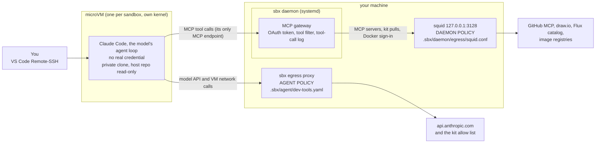
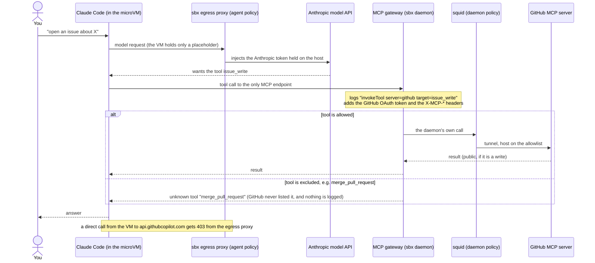
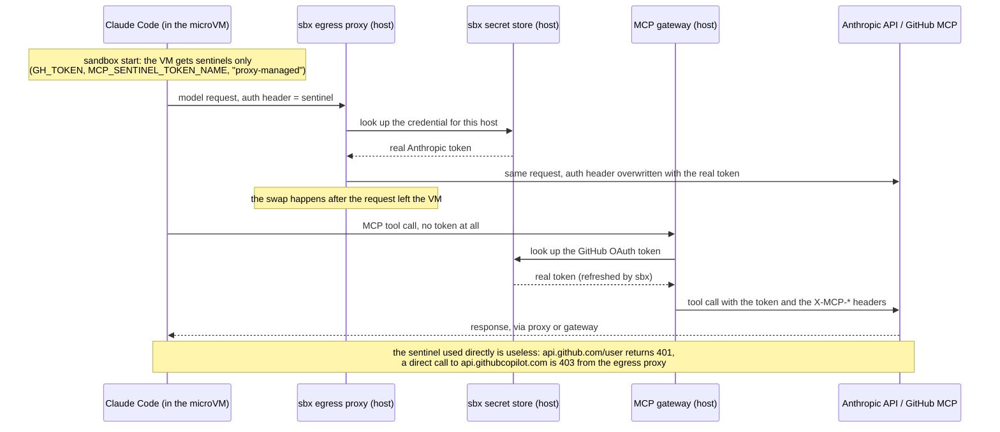

# sandboxing agents

## What we are building

A coding agent you can run without handing it your machine.

- **The agent:** Claude Code, inside an `sbx` microVM, working on a private clone of the repo and holding no real credential.
- **The MCP servers:** GitHub (OAuth, tool filter), draw.io and the Flux schema catalog. The agent reaches them only through a gateway on the host.
- **The guardrails:** an egress allow list for the VM, a gateway that holds the GitHub token and filters its tools, and an allowlist proxy for the sbx daemon's own calls.

What we take as given, so the sandbox's value shows on its own:

- a Linux host with KVM, rootless Docker, systemd user services and `sbx` installed ([Prerequisites](#prerequisites));
- one GitHub App on one repository, with `main` protected (a pull request and one approval);
- secrets in a sops-encrypted file on the host
- review before merge with pull requests


What it shows: a fooled agent is capped to what the sandbox allows. Credentials stay out of the VM, egress is an allow list, destructive tools are filtered, and the damage stays in one repo.

This follows Anthropic's [How we contain Claude across products](https://www.anthropic.com/engineering/how-we-contain-claude) (May 25, 2026): enforce hard limits in the environment instead of relying on the model. Its three principles, and what this setup does with each (the quotes and the layer-by-layer mapping are in the [notes](docs/research/readme-notes.md)):

- **Limit what the agent is *able* to do, not what it does.** "Rather than supervising what the agent does, we supervise what it's able to do." The VM reaches only the repo clone and allow-listed hosts: a repo `DELETE` is 403 at the egress proxy, and the gateway removes `merge_pull_request`, `delete_file`, `delete_repository`, `create_repository` and `fork_repository` from the tool list (a call gets `unknown tool`). Still able: write to the one repo the App covers. Demo section 1.
- **Keep credentials out of the sandbox.** "If credentials never enter the sandbox, they can't be exfiltrated." The VM holds placeholders (`GH_TOKEN` gets 401 from GitHub). The egress proxy adds the model token and the sbx MCP gateway adds the GitHub token, both on the host, after the request has left the VM. Exception: a kit with OAuth `passthrough: true` sends the real token in; this kit does not use it. Demo section 2.
- **An allowed domain is a capability grant.** "Every function reachable through any domain on an allowlist is now an attack surface." There are two allow lists, one for the agent (egress proxy) and one for the daemon's own calls (our squid), and the tool filter narrows what the GitHub host can do. Demo section 3; the evidence is in the [threat table](#threats-and-what-stops-them).


## Demo: the sandbox in 45 seconds

<script src="https://asciinema.org/a/rGA78COFnm6hs3SF.js" id="asciicast-rGA78COFnm6hs3SF" async="true"></script>

One section per principle:

| About | Section | What you see |
|---|---|---|
| 0:00 | 1. Limit what the agent is able to do | two different kernels; `github.com` 200, `example.com` 403, a repo `DELETE` 403; the 52 tools the agent sees, with merge and delete absent and `issue_write` present; `merge_pull_request` returns `unknown tool`; the proxy's log line for the refused `DELETE` |
| 0:15 | 2. Credentials never enter the sandbox | `ls ~/.ssh ~/.aws` fails and the user is `agent`; the token variable names; `GH_TOKEN` against `api.github.com/user` returns 401; a direct call to the MCP host is 403; `list_branches` through the gateway works with no token in the VM |
| 0:29 | 3. An allowed domain is a capability grant | a dummy string is delivered to `registry.terraform.io` and to an S3 bucket nobody owns; an untracked host file is readable at `/run/sandbox/source`; the GitHub write tools are still open |

## The problem

A coding agent that runs on your machine runs as you: it can read what you can read and use what you can use. Anyone who can put text in front
of it can try to steer it, through a GitHub issue, a web page or a tool result, and the agent cannot reliably tell their text from yours.

Earlier parts: [Part 1](../mcp-sandbox/part-1-lethal-trifecta/README.md) shows the attack and [Part 2](../mcp-sandbox/part-2-sandboxing-local-mcp/README.md) contains the MCP server. This part moves the agent itself into a sandbox.

## The solution

Claude Code runs inside an `sbx` microVM, on a private clone of the repo, and holds no real credential. The MCP servers (GitHub, draw.io, the Flux schema catalog) are registered on the host's sbx MCP gateway, so the agent
reaches them only through it. The gateway holds GitHub's OAuth token and sets the tool filter headers where the agent cannot change them.
Every other outbound request goes through an egress allow list, with a deny list on top (both in `.sbx/agent/dev-tools.yaml`).
The sbx daemon runs on the host, outside the VM, and makes the MCP calls and kit pulls itself, so its own outbound calls go through a squid allowlist
that systemd keeps running (`.sbx/daemon/`).


### How it is laid out



| Who controls what | Applies to | Where to change it |
|---|---|---|
| Agent policy: the kit's egress allow and deny lists | what the VM itself connects to | `.sbx/agent/dev-tools.yaml` |
| MCP gateway: OAuth token, tool filter, tool-call log | every MCP call from the agent | `.sbx/daemon/Taskfile.yml` (vars), `task sandbox:install-mcp` |
| Daemon policy: squid allowlist | what the sbx daemon itself connects to (MCP servers, kit pulls, Docker sign-in) | `.sbx/daemon/egress/squid.conf` |

### Where the microVM sits on your machine

The host side around the VM, drawn as in the [one-pager](docs/writeup/executive-one-pager.html): the VM, the two proxies, the gateway into squid, and where each route leaves the machine. Measured on this machine with `ps`, `ss`, `sbx secret ls` and `sbx exec` (sbx 0.46.0, 2026-10-09).
The earlier box-drawing version, with the secret store, VM runner and systemd units, is in the git history of this file (commit `671673a`).


### How it works

One agent turn, with the model, the sandbox and the three control points. Direct routes from the VM to the MCP hosts are denied by the egress proxy.



### How secrets get in

The same turn from the microVM's side, for credentials only. The VM holds a sentinel; the real value is added on the host after the request has left the VM. Putting the secrets in the host store (sops, `sbx secret set`) is in [Prerequisites](#prerequisites).



One exception in sbx: a kit with OAuth `passthrough: true` sends the real token into the VM. This kit does not use it.

## Prerequisites

Have these in place before the first command in [Getting started](#getting-started).

1. **Host tools.** [mise](https://mise.jdx.dev). VS Code with its `code` command on the PATH (`command -v code`): mise cannot install it, and `sandbox:run` and step 6 use it.
2. **sbx.** Follow Docker's [install guide](https://docs.docker.com/ai/sandboxes/install/) 
3. **Rootless Docker as a user service, and linger.** The daemon's proxy runs in it and user services must start at boot.
   See [`code/rootless-docker`](../rootless-docker). Check:

   ```shell
   systemctl --user is-enabled docker.service     # enabled
   loginctl show-user "$USER" -p Linger           # Linger=yes
   ```

4. **A GitHub App**, set up once in GitHub. The agent's GitHub access is this App's OAuth token, held by the gateway
   - Install it on only the repository the agent needs, with only the permissions it needs (today: contents, issues, pull requests: write; no administration).
   - Add the callback URL `http://127.0.0.1:8765/callback`, turn on **Expire user authorization tokens**, and generate a client secret.
   - Its client id is in `.sbx/daemon/Taskfile.yml`.
5. **Secrets.** Two live in the sops-encrypted `.env.secrets.json` at the repo root; edit it with `sops .env.secrets.json`.

   | Secret | Stored in | Used by |
   |---|---|---|
   | `GITHUB_TOKEN`, a token for the ghcr.io kit image | `.env.secrets.json` | `task sandbox:login`, once |
   | `GITHUB_APP_CLIENT_SECRET`, the App's client secret | `.env.secrets.json` | `task sandbox:install-mcp`, piped into sbx's secret store, never printed |
   | GitHub's OAuth token | sbx's host credential store, created by the browser consent | the gateway; never inside the VM |
   | your age key (decrypts the file) | `~/.config/sops/age/keys.txt` | `sops` |

## Getting started

Run these in order, from the repo root.

1. Install the host tools, and activate mise in your shell so `task` is on the PATH (add the `eval` line to your shell rc to keep it; a new shell needs it too):

   ```shell
   mise trust && mise install
   eval "$(mise activate bash)"      
   task --list
   ```

2. Set sbx once:

   ```shell
   sbx settings set kit.allowedSources '["docker.io/","ghcr.io/raghav19/dev-agent-sandbox"]'
   sbx settings set ssh.agentForwardingEnabled false    # do not forward your SSH agent into the sandbox
   ```

3. Log in to the registry (reads `GITHUB_TOKEN`, needs your age key):

   ```shell
   task sandbox:login
   ```

4. Set up the daemon's proxy and units on the host. This restarts the sbx daemon, so do it before you start a sandbox. How the parts fit:
   [`.sbx/daemon/README.md`](../../.sbx/daemon/README.md). The steps, checks, logs and undo are the comments above `sandbox:install-daemon` in `.sbx/daemon/Taskfile.yml`.
   The daemon unit runs `~/.docker/sbx/bin/sbx`: if `command -v sbx` prints another path, change `ExecStart` in `.sbx/daemon/systemd/sbx-daemon.service` to it first.

   ```shell
   task sandbox:install-daemon
   ```

5. Install the agent skills:

   ```shell
   task sandbox:install-skills
   ```

6. Connect VS Code:

   ```shell
   sbx setup ssh
   code --install-extension ms-vscode-remote.remote-ssh
   ```

7. Start the sandbox. Commit first: only committed files are in the clone.

   ```shell
   task sandbox:run
   ```

   The first time, sbx shows its plan and asks you to approve it. Run Claude Code in the VS Code terminal: it runs inside the sandbox. Run the task again
to reopen the window. The first run also opens a browser once for GitHub's consent. Run Claude Code in the VS Code terminal: it runs inside the sandbox.

Day to day: run `task sandbox:run` again to reopen the window. `task sandbox:build` (maintainer) rebuilds and pushes the tools image, `task sandbox:update-skills`
refreshes the skills. Egress rules for the VM live in the kit image, so after changing them run `task sandbox:build` and create a new sandbox.

## Reference

### Directory structure

```text
.sbx/                               everything that spawns the sandbox
├── Taskfile.yml                    orchestration: sandbox:login and sandbox:run (the ordered start); includes the two folders below
├── sbxenv.yaml                     the sandbox: kits, size, clone workspace
├── agent/                          AGENT POLICY: what runs inside the VM
│   ├── Taskfile.yml                sandbox:build, :install-skills, :update-skills, :setup-vscode
│   ├── dev-tools.yaml              the kit: tools, completions, shell, egress allow and deny lists (+ its .dockerignore)
│   └── tools.toml                  the sandbox's tools at exact versions, Terraform cache settings, the completions task
└── daemon/                         DAEMON POLICY: what the sbx daemon and its MCP gateway may reach
    ├── README.md                   what is set up on the host and how (read first: it is a prerequisite for the tasks)
    ├── Taskfile.yml                sandbox:install-daemon (once per machine), sandbox:install-mcp
    ├── systemd/                    the two user units: the proxy and the sbx daemon (installed by sandbox:install-daemon)
    └── egress/
        ├── compose.yaml            squid for the daemon on 127.0.0.1:3128
        └── squid.conf              the allowlist: the one file to edit to change what the daemon may reach
```

### Threats and what stops them

✅ stopped · ⚠️ partly (gap in brackets) · ❌ not stopped. ✅ assumes the givens in [What we are building](#what-we-are-building) (protected `main`, review before merge). Rows are grouped by the layers in Anthropic's
[How we contain Claude](https://www.anthropic.com/engineering/how-we-contain-claude): environment, model, external content, plus monitoring. Egress is enforced here with allow and deny rules and proxies, not CEL or Cedar policies; the model side is left for a later exercise.

| Layer | Threat | Agent sandbox (microVM) |
|---|---|---|
| Environment | Agent escapes to the host | ✅ own kernel per sandbox, where a container shares the host's (sbx design, not tested here) |
| Environment | Compromised MCP server code | ⚠️ (gap: none runs locally, but the hosted servers are trusted) |
| Environment | Data leaving: allowed hosts | ⚠️ (gap: sbx's default baseline for agent work (package managers, code hosts, AI services, OS packages, certificate checks) is right for research in the sandbox, but a few multi-tenant wildcards such as `**.amazonaws.com` also match other people's buckets; `registry.terraform.io` and an S3 bucket accepted a body in testing) |
| Environment | Data leaving: MCP writes | ⚠️ (gap: the agent writes to the one repo by design; if it is public, a host-only file reached a public issue in testing) |
| Environment | Credentials stolen or misused | ✅ the VM holds placeholders (`GH_TOKEN` returns 401); the real token stays in the gateway and the direct route is 403 |
| Environment | Destructive tools (delete, merge, push to `main`) | ✅ delete, merge, create-repo and fork are excluded at the gateway (a deny list, so new upstream tools are allowed); a direct `DELETE` to the GitHub API is 403 at the proxy; `main` needs a PR and one approval (a GitHub setting; the App's direct push was not tried) |
| Environment | Files that run on your host (merged `.sbx/`, Taskfiles) | ✅ the agent edits only its clone; a change reaches the host through a merge you review |
| Environment | Host files the agent can read | ⚠️ (gap: untracked and ignored files in the repo dir are readable, and `.gitignore` lacks `.env`, `*.pem`, `*.tfstate`; the rest of your home is not visible) |
| Environment | Tampered images or scripts | ⚠️ (kit and squid image pinned by digest, not signed: `kit.requireSignature` is off) |
| Model, external content | Injected instructions (issue text, tool results, pages) | ❌ not a sandbox control (Part 1's two refusals were the model) |
| External content | Planted instructions that persist (`AGENTS.md`, memory, session history) | ✅ contained: the next session in the sandbox obeys them at once, but only within the egress, gateway and branch-protection limits; they reach `main` only through review and end at `sbx rm` |
| Monitoring | Record of what the agent did | ⚠️ (gap: rejected tool calls and arguments are not recorded) |

Out of scope: a vulnerability in the VMM itself, tool descriptions that lie, a compromised GitHub or model
provider.

#### The lethal trifecta: what the sandbox contains

The trifecta is private data, untrusted content and a way to send data out, all in one agent.

| Leg | What the sandbox does | What remains |
|---|---|---|
| Private data | Your home, `~/.ssh`, `~/.aws` and every real credential are out of reach. Clone mode keeps the agent on the repo, which it needs. | The repo directory, including untracked and ignored files, is readable (accepted by design: keep plaintext secrets out of it). |
| Untrusted content | Nothing. | Issues, tool results and pages reach the agent as before; the model side is Part 3. |
| A way out | Direct routes to the MCP servers and the GitHub API are blocked (403/401). | MCP writes reach the one repo the App covers. If it is public, what the agent writes there is public: in testing it published an untracked file to a public issue (the worst case). |

So the sandbox limits the **blast radius** and is a necessary piece to solve the puzzle. 

## What is left ahead

- **A gateway with rules:**
  - per-tool rules: sbx's own (Cedar) need a paid Docker org subscription; a gateway of your own can limit tools by name, repo and user;
  - arguments: look at them and log every call, including rejected ones (today: allowed calls by name only);
  - per-repo write limits and an allow-list or read-only GitHub for sessions that only need to read.

- **Model side:** scan instruction files and memory (`AGENTS.md`, `~/.claude/CLAUDE.md`) when a session starts, since a planted instruction is reloaded each time; Anthropic's post suggests classifiers at session startup.

- **Smaller gaps from the threat table:** `.env`, `*.pem` and `*.tfstate` in `.gitignore`; signed kits (`kit.requireSignature`); a tighter baseline for S3.


## Key learnings

- **Work in a clone, in its own kernel.**
  - The microVM has its own kernel, and the agent commits to a private clone of a read-only host repo.
  - Never keep plaintext secrets in the repo directory: untracked and ignored files stay readable at `/run/sandbox/source`. This means when working with agents, always work within the sandbox and pull changes onto the host via branches committed by the agent.

- **Inject secrets through the host, never into the VM.**
  - The VM holds sentinels (`GH_TOKEN` gets a 401). The egress proxy adds the model token and the gateway adds the GitHub token ([How secrets get in](#how-secrets-get-in)).
  - The GitHub token carries only the App's permissions: contents, issues and pull requests (write), no administration, one repository.

- **Treat every allowed host as a grant.**
  - Anything in the VM can use every host on an allow list. Keep both lists (agent: egress proxy, daemon: squid) to what the work needs.
  - sbx's baseline includes shared-hosting wildcards (`**.amazonaws.com`, `**.googleapis.com`, `**.blob.core.windows.net`). Trim them.

- **Send every MCP call through the gateway.**
  - It is the VM's only MCP endpoint (a direct call gets a 403). It adds the token and applies the `X-MCP-*` filter, which the agent cannot change; excluded tools return `unknown tool`.
  - Registrations are host-wide and the agent can attach any registered server. Register only what any sandbox may use (`sbx mcp ls`).

- **Merge only through a pull request you approve.**
  - The agent can branch, commit and open pull requests. `merge_pull_request` is excluded and `main` requires one approval.
  - Review its commits at `sandbox-<name>` on 127.0.0.1 (read-only) before you push.

- **Assume what the agent writes can leave.**
  - Writes reach the one repo the App covers. If it is public, the agent can post a file it can read to a public issue, so keep nothing sensitive untracked in the repo directory.

- **Read the logs, and know the gap.**
  - Hosts: `sbx policy log`. Allowed tool calls by name: `sandboxd/mcp/mcp.log`. Daemon hosts: `docker logs sbx-daemon-egress`.
  - Rejected tool calls and their arguments are not logged.
