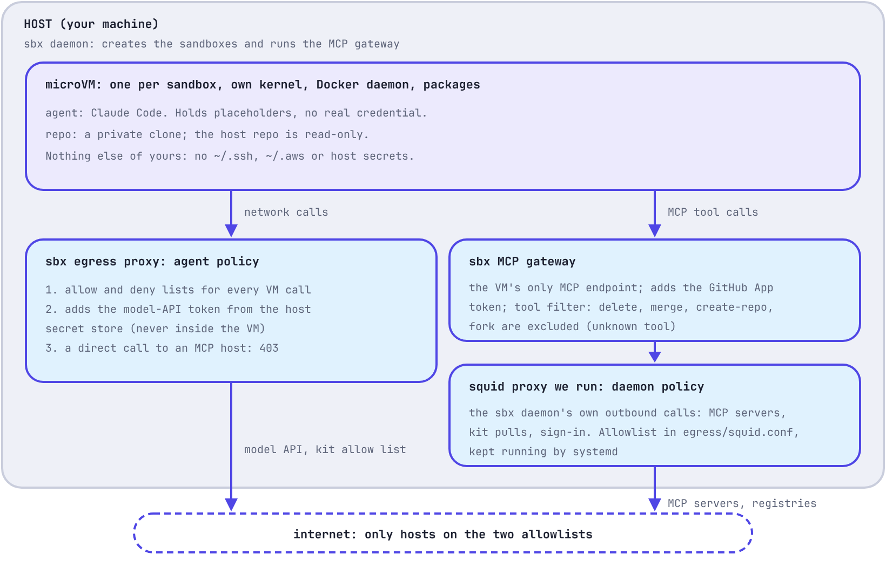

# don't trust your coding agent, sandbox it

*claude code in a microvm: what it can reach, what it can't, and where a sandbox stops*

---

an agent picks each command while it runs, based on your prompt and on text it reads: issues, web pages, tool results. you can't review those actions ahead of time, and a hidden instruction in an issue can change what it does next.

so i stopped trying to make the agent behave. anthropic's post [how we contain claude across products](https://www.anthropic.com/engineering/how-we-contain-claude) argues for hard limits in the environment instead, and gives three principles. i built the sandbox around them:

1. **limit what the agent is able to do, not what it does.** "rather than supervising what the agent does, we supervise what it's able to do."
2. **keep credentials out of the sandbox.** "if credentials never enter the sandbox, they can't be exfiltrated."
3. **an allowed domain is a capability grant.** "every function reachable through any domain on an allowlist is now an attack surface."

this post is the setup, a demo with one section for each principle, and what i learned.

## what i built

claude code running inside a [docker sandboxes](https://docs.docker.com/ai/sandboxes/) (`sbx`) microvm, on a private clone of my repo.

- **the agent:** its own kernel, a clone of the repo, no real credentials.
- **the mcp servers:** github, draw.io and the flux schema catalog. the agent reaches them only through a gateway on the host.
- **the guardrails:** an egress allow list for the vm, a gateway that holds the github token and filters its tools, and a squid allow list for the sbx daemon's own calls.

## how it fits together

the vm makes two kinds of calls. network calls go through the sbx egress proxy. mcp tool calls go to the gateway on the host, and from there through a squid proxy i run. a direct call from the vm to an mcp host gets a 403.

## the demo (45 seconds)

one section for each of anthropic's three principles. click the image to watch it on asciinema, where you can pause and read along.

1. **limit what the agent is able to do.** two different kernels. `github.com` returns 200, `example.com` returns 403, a repo `DELETE` returns 403. `merge_pull_request` returns `unknown tool`.
2. **keep credentials out.** no `~/.ssh` or `~/.aws`. `GH_TOKEN` is a placeholder and github answers 401. a direct call to the mcp host is 403, yet `list_branches` through the gateway works.
3. **an allowed domain is a capability grant.** a dummy string reaches `registry.terraform.io` and an s3 bucket nobody owns, and an untracked file from my host is readable in the vm.

## key learnings

- **work in a clone, in its own kernel.** never keep plaintext secrets in the repo directory: untracked and ignored files stay readable in the vm. so work with agents inside the sandbox and pull changes back through branches.
- **inject secrets through the host, never into the vm.** the vm holds placeholders. the egress proxy adds the model token and the gateway adds the github token.
- **treat every allowed host as a grant.** sbx's default list has shared-hosting wildcards like `**.amazonaws.com`. trim them.
- **send every mcp call through the gateway.** it is the vm's only mcp endpoint and the agent cannot change its tool filter. registrations are host-wide, so register only what any sandbox may use.
- **merge only through a pull request you approve.** the agent can branch, commit and open pull requests, but it cannot merge.
- **assume what the agent writes can leave.** in testing it posted an untracked file to a public issue through an allowed write tool.
- **read the logs, and know the gap.** rejected tool calls and their arguments are not logged.

## where it stops

the sandbox limits the blast radius. there is one thing it cannot fix, and then a list of gaps in my setup that i can close or accept.

**what a sandbox cannot fix**

- **injected instructions.** the agent still reads issues, tool results and web pages. a hidden instruction can still fool it. that is a model-side problem, not a sandbox control.

**gaps in this setup**

- **writes to the one repo.** the app can write to the repo it covers. if the repo is public, so is what the agent writes: in testing, a file from my host that was never committed ended up in a public issue.
- **allowed hosts are grants.** a dummy string reached `registry.terraform.io` and an s3 bucket nobody owns, because sbx's default list has wildcards like `**.amazonaws.com`. i have not trimmed them yet.
- **files in the repo directory.** untracked and ignored files are readable in the vm. the rule is to keep nothing sensitive there: no `.env`, `*.pem` or `*.tfstate`, and work through the sandbox so no stray files land on the host copy.
- **a deny list for tools.** merge, delete, create-repo and fork are excluded, but a new tool that github adds is allowed until i exclude it.
- **blind spots in the logs.** rejected tool calls and their arguments are not recorded.
- **unsigned images.** the kit and squid images are pinned by digest, not signed.
- **what i trust and leave out of scope.** a bug in the vm monitor itself, which would break the own-kernel isolation. tool descriptions that lie. a compromised github or model provider. the hosted mcp servers.

## the code

everything is in the repo: the kit, the gateway setup, the squid config, the threat table and the demo script.

[github.com/raghav19/engineersdaybook/tree/main/code/agent-sandbox](https://github.com/raghav19/engineersdaybook/tree/main/code/agent-sandbox)

---

*docker and docker sandboxes (`sbx`) are trademarks of docker, inc. this is an independent project and is not affiliated with or endorsed by docker.*
