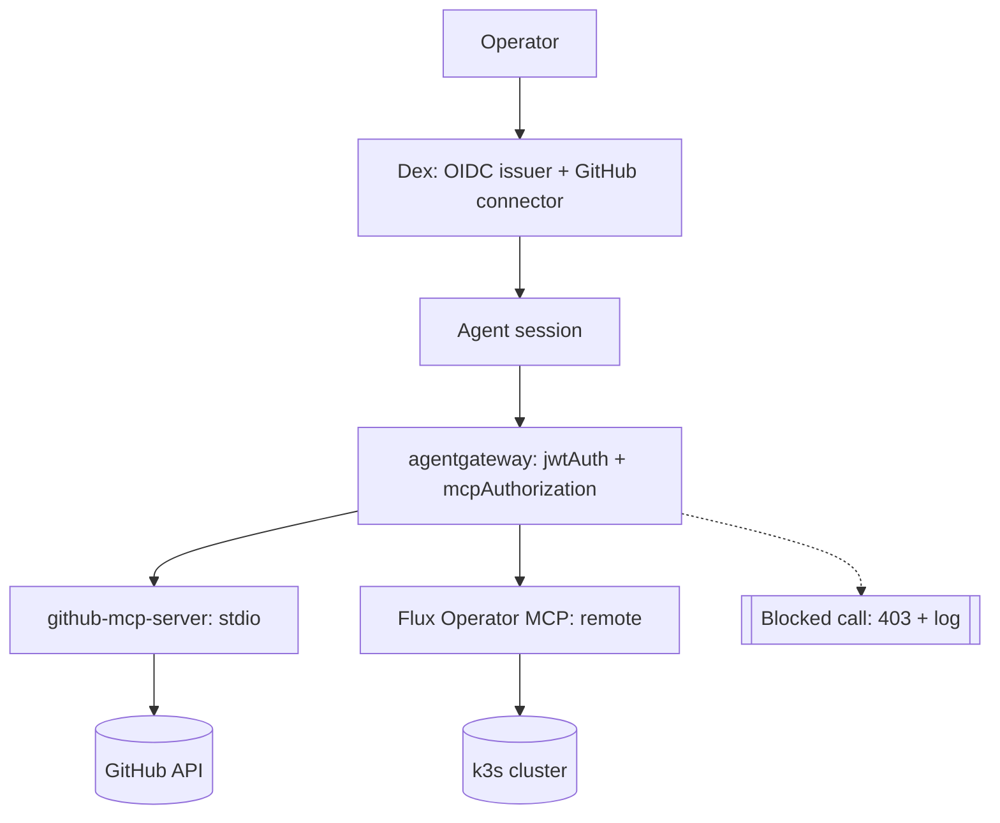

# Spec: MCP Gateway Architecture (Part 2)

Status: ready-for-agent

## Architecture Diagram

The final diagram is a colored Excalidraw topology view, colored by trust zone (identity chain in blue, the gateway/enforcement point in orange, allowed backend MCP servers in green, external systems in gray, the blocked/denied path in red). The source file is committed at `assets/enterprise-architecture.excalidraw` in this folder — open it at [excalidraw.com](https://excalidraw.com) (File → Open) or in the Excalidraw VS Code extension, then export as PNG to embed here, in the README, and in the Medium post.

Structural fallback below (renders natively on GitHub, useful when reviewing this spec before the PNG export exists):

## Problem Statement

Part 1 showed that a real MCP attack — a poisoned public issue attempting to exfiltrate a private repo's content through an over-scoped token — can be caught by a model's own judgment. But judgment isn't something to architect around: it isn't enforceable, isn't auditable the way a policy layer is, and varies by model and by phrasing. Anyone connecting agents to real MCP servers at any meaningful scale needs a defense that doesn't depend on hoping the model notices — and needs an honest account of how far a gateway-based defense actually reaches, so "hope the model notices" isn't just replaced with an equally unexamined "hope the gateway covers everything."

## Solution

Build and run a real MCP gateway architecture: **agentgateway**, deployed as a standalone Kubernetes Gateway API ingress (no Istio control plane), fronting two MCP servers over two different transports — `github-mcp-server` via stdio, Flux Operator MCP via remote Streamable HTTP/SSE — behind one GitHub-OAuth-derived JWT identity (via Dex). Runs on a disposable, single-node k3s cluster on a Hetzner Cloud VM, torn down after evidence capture.

Demonstrate four distinct things, each backed by a real captured receipt (agentgateway's own structured decision logs), not prose assertion:

1. **Call-time re-authorization** — replay Part 1's exact attack pattern against fresh throwaway repos; show it blocked at the gateway regardless of model judgment.
2. **Discovery-time tool filtering** — a read-only-scoped Flux identity's `tools/list` genuinely never contains the destructive tools at all.
3. **Argument-level policy** — a CEL rule blocking an attempt to disable Flux's default secret-masking behavior, a finer grain than identity+target alone.
4. **The honest limit** — a cross-server context-leak scenario, where content read from one backend can still be smuggled into a call to the other backend, because identity+target policy has no visibility into what a session already read elsewhere.

Map the full OWASP MCP Top 10 (not just Part 1's four-category subset) against this architecture in a ticked/checklist format, naming what's genuinely closed, what's a real but accepted gap at POC scale, and what's a non-fit — continuing the series' discipline of receipts over assertions, honest gaps over padded coverage. Close with a plain-language Medium post and three staggered LinkedIn posts, each linking back to it.

## User Stories

1. As the operator, I want a disposable, single-node k3s cluster running on a Hetzner Cloud VM I provision myself, so that the gateway has real, adequate compute without touching my local machine's constrained resources.
2. As the operator, I want the VM provisioned manually by me (no Terraform/IaC in-repo), so that no Hetzner API token ever needs to pass through the agent or chat.
3. As the operator, I want k3s chosen specifically for its built-in LoadBalancer support, so that the Gateway resource gets a real external IP without an extra shim.
4. As the operator, I want agentgateway deployed as a standalone Kubernetes Gateway API ingress with no Istio control plane installed, so the architecture stays exactly as complex as this demo needs, with ambient-mesh mTLS explicitly deferred to a later part.
5. As the operator, I want agentgateway pinned to the latest release compatible with Kubernetes 1.35, no earlier than v1.4.0, so the deployment includes a real fixed stateful-session policy-bypass vulnerability rather than a known-vulnerable version.
6. As the operator, I want a real GitHub OAuth App I register myself, federated through Dex into a signed JWT, so the identity driving every demo is a real, checkable login rather than a synthetic token.
7. As the operator, I want agentgateway's `jwtAuth` policy to validate every request against Dex's issuer and JWKS, so no unauthenticated request reaches either backend.
8. As the operator, I want the GitHub fine-grained PAT used by `github-mcp-server` stored as a Kubernetes Secret rather than an environment variable, so credential handling follows current OWASP MCP guidance rather than repeating Part 1's documented anti-pattern.
9. As the operator, I want the exact same lethal-trifecta attack pattern from Part 1 replayed against fresh throwaway repos, so readers can directly compare "caught by model judgment" against "blocked by policy, regardless of model judgment."
10. As the operator, I want the blocked call to produce a real, captured deny response and decision log line, so "blocked" is demonstrated with a receipt, not asserted in prose.
11. As the operator, I want Flux Operator MCP deployed with two genuinely distinct identities — one read-only-scoped, one full-control-scoped — so the filtering demo shows real `tools/list` differences, not a staged example.
12. As the operator, I want the read-only identity's `tools/list` response captured showing the destructive tools genuinely absent, so "the agent's own context never offers delete as an option" is demonstrated, not claimed.
13. As the operator, I want an `mcpAuthorization` rule blocking an attempt to disable Flux's default secret-masking behavior, so the demo shows policy enforcement at the argument level, not just identity+target.
14. As the operator, I want a fourth demo showing one identity reading sensitive content from the GitHub server and then attempting to embed it into a call to the Flux server, so the write-up honestly shows what identity+target policy does *not* catch.
15. As the operator, I want that cross-server leak's receipt to be agentgateway's own captured call arguments showing the leaked content passing through unblocked, so the gap is demonstrated the same way the wins are — with a real artifact, not an assertion.
16. As the operator, I want agentgateway's structured MCP-aware decision logs (tool, target, caller identity, arguments, outcome) captured live during every demo run, so every claim in the write-up is backed by a real logged line.
17. As the operator, I want the full OWASP MCP Top 10 mapped against this architecture in a ticked/checklist format, so a reader can see at a glance what's covered, what's an accepted gap, and what's a non-fit.
18. As the operator, I want every named gap (MCP05 command injection; MCP03/MCP04 supply chain) stated honestly with the specific reason it isn't closed, so the write-up doesn't overclaim what a policy gateway can do.
19. As the operator, I want MCP08's "immutable" audit-trail requirement named as not fully satisfied by the POC's captured logs, so the write-up doesn't claim more rigor than a `kubectl logs`-captured file actually has.
20. As the operator, I want a one-line note that Kubernetes-native policy engines (Kyverno/OPA Gatekeeper) are complementary, different-control-plane defense-in-depth rather than an MCP-level mitigation, so the write-up shows breadth of understanding without building an unrelated component.
21. As a reader, I want a single colored architecture diagram at the top of the write-up showing the full topology by trust zone, so I can understand the shape of the system before reading any demo detail.
22. As a reader, I want each of the four demos shown through its own captured receipt (deny response, `tools/list` diff, blocked argument, leaked content) rather than a shared narrative summary, so I can independently verify each specific claim.
23. As a reader, I want the write-up in plain, non-jargon language ("gatekeeper," not "policy engine" or "CEL authorization") throughout headers and framing, so the value is clear without requiring prior Kubernetes/Istio/MCP background.
24. As a reader, I want the write-up to make no mention of rootless Docker/Kubernetes at all, so I'm not introduced to a concept with no bearing on what was actually built.
25. As a reader, I want three short LinkedIn posts, staggered over roughly a week, each linking back to the same Medium post and covering a distinct angle (the judgment problem, the wins, the honest limit), so I can engage at whatever depth I have time for.
26. As the operator, I want the whole environment (VM, k3s cluster, both MCP servers, Dex, the GitHub OAuth App) torn down after evidence capture, so nothing keeps costing money or presenting attack surface after the write-up is done.

## Implementation Decisions

- **Location**: `code/mcp-sandbox/part-2-mcp-gateway/`, sibling to `part-1-lethal-trifecta/`. A `research/` subfolder already holds primary-source investigation for the OWASP MCP05/MCP08 questions — read before implementing, don't re-derive. An `assets/` subfolder holds the Excalidraw diagram source.
- **Infra**: single Hetzner Cloud VM (CPX41, EU region), provisioned manually by the operator, hourly-billed, ephemeral — spun up, built, evidence captured, torn down.
- **Cluster**: single-node **k3s** installed directly on the VM (not kind, not inside Docker) — chosen for built-in ServiceLB, giving the Gateway a real external IP with no extra load-balancer shim. Standard installation; no rootless-container-engine layer anywhere in this stack, and the write-up must not mention rootless at all — it has no bearing on what's actually built here.
- **Gateway**: agentgateway deployed as a standalone Gateway API `GatewayClass`/ingress — no Istio control plane installed in Part 2. Version: the latest release compatible with Kubernetes 1.35 at build time, no earlier than **v1.4.0** (fixes a real stateful MCP-session/route policy-bypass advisory, `GHSA-mvgg-jvj2-4frq`). Latest tagged release as of this spec's research was v1.5.0 (2026-08-27) — re-verify at actual build time since this moves.
- **Identity chain**: **Dex** (with its GitHub connector) runs as the OIDC issuer, federating a real GitHub OAuth device-flow login into a signed JWT on its own JWKS endpoint. The GitHub OAuth App (client ID/secret, callback URL) is registered manually by the operator — never touches the agent or chat. agentgateway's `jwtAuth` policy validates every request against Dex's issuer + JWKS. Confirmed: Istio's own `RequestAuthentication`/`AuthorizationPolicy` CRDs are architecturally irrelevant to agentgateway even under full Istio integration (Istio only configures agentgateway via Gateway API resources + agentgateway's own native `AgentgatewayPolicy` CRD) — this applies regardless of whether Part 3 later adds Istio.
- **`github-mcp-server`**: same official `ghcr.io/github/github-mcp-server` local-stdio image as Part 1. A fine-grained PAT, scoped to two fresh throwaway repos (one public, one private, mirroring Part 1's shape but not the same repos — Part 1's were archived and their PAT revoked), stored as a **Kubernetes Secret** rather than a bare env var. Demo 1 replays Part 1's poisoned-issue attack pattern; the identity authorized for the public-repo target gets a call-time deny the instant a (subverted) call targets the private repo — before the request reaches GitHub's API.
- **Flux Operator MCP**: official `controlplaneio-fluxcd/charts` `flux-operator-mcp` Helm chart, remote Streamable HTTP/SSE transport, connected to the same k3s cluster via kubeconfig. Used purely as a demo target — **not** used to GitOps-manage Part 2's own deployment. Two kubeconfig identities: read-only (status/diagnostics only) and full-control (reconcile/suspend/resume/apply/delete). Demo 2 (discovery-time filtering) and Demo 3 (argument-level policy, blocking an attempt to disable Flux's default secret-value masking) both run against this server.
- **Demo 4 (cross-server leak)**: same JWT identity, authorized for both a GitHub-side read and a Flux-side write. Reads sensitive content via the GitHub leg, then constructs a Flux call embedding that content in an argument (exact field — e.g. a commit message/annotation/patch value — is a build-time detail, dependent on Flux Operator MCP's actual tool schema). `mcpAuthorization` evaluates the call on identity+target alone and allows it — demonstrating the documented gap already captured in `agentgateway-mcp-policy-model`: no stateful, provenance-aware policy exists to express "this session already read tainted content, therefore deny this write." Reclassifies MCP10 from non-fit to demonstrated-but-not-solved, same honest treatment MCP06 already gets.
- **Evidence capture (all four demos)**: attach a `Logging` policy adding `tool_caller: 'jwt.sub'`, `tool_args: 'mcp.tool.arguments'` (scoped to the two demo routes only, per agentgateway's documented performance caveat on large payloads), and `status: 'response.code'`. Capture via `kubectl logs -f deployment/<agentgateway-proxy> -n <ns> | tee <run-log>` during each live demo run — the same capture-then-verify pattern Part 1 used for GitHub API evidence. No collector/SIEM; the full documented OTel stack is real but oversized for a one-VM POC.
- **OWASP MCP Top 10 mapping**, full 10 categories, ticked/checklist format in this spec's high-level view plus a detailed table in the write-up (verdicts already researched, see `research/mcp05-mcp08-gap-investigation.md` and this session's grilling):
  - ✅ **MCP01** (Token Mismanagement) — PAT in a K8s Secret.
  - ✅ **MCP02** (Privilege Escalation via Scope Creep) — CEL policy re-derived every call, nothing to accumulate.
  - ⚠️ **MCP03** (Tool Poisoning) — named, accepted gap: no digest/signature pinning on either backend image. Low urgency for a one-shot, torn-down POC.
  - ⚠️ **MCP04** (Supply Chain) — same shape as MCP03, same accepted-gap treatment.
  - ⚠️ **MCP05** (Command Injection & Execution) — named, **confirmed unclosable via `mcpAuthorization` today**: `mcp.tool.arguments` is mechanically absent from the CEL context at authorization time (confirmed against agentgateway's own schema/architecture docs, corroborated by a real CVE, `CVE-2026-29791`). A coarse mitigation is buildable via MCP Guardrails (ExtMCP), but that means writing and hosting a custom gRPC inspection service — sized like a component you build, not a policy you toggle — and even then it can't see content a downstream server fetches and internally acts on. State this plainly; don't build ExtMCP for this spec.
  - ✅ **MCP06** (Intent Flow Subversion) — covered, **precisely scoped**: the gateway contains the *consequence* (call-time deny on the private-repo target) — it does not detect or prevent the injection itself. Write up as "makes subversion inconsequential," never as "stops prompt injection."
  - ✅ **MCP07** (Insufficient AuthN/AuthZ) — the architecture's core: Dex + `jwtAuth` + `mcpAuthorization` across both transports uniformly.
  - ✅ **MCP08** (Lack of Audit/Telemetry) — covered, with **"immutable" explicitly named as not satisfied**: structured decision logging is real, native, and config-only (confirmed against agentgateway's schema); captured stdout is not durable/tamper-evident without an extra OTLP-to-durable-sink step, not built for this POC.
  - ❌ **MCP09** (Shadow MCP Servers) — non-fit: single-operator demo, no organizational governance surface for "shadow" infrastructure to evade. (Write-up may note, as an aside, that the org-level answer looks like CSPM applied to MCP infrastructure.)
  - ⚠️ **MCP10** (Context Injection & Over-Sharing) — reframed via Demo 4 from non-fit to **demonstrated-but-not-solved**: within a single session, the model's shared context window lets content read from one backend flow into a call to another, and identity+target policy doesn't catch it.
  - One-line aside (not a category, not a built component): Kubernetes-native policy engines (Kyverno/OPA Gatekeeper) operate on a different control plane entirely (Kubernetes API admission, not MCP protocol traffic) — real complementary defense-in-depth for what Flux actually writes to the cluster, but irrelevant to every gap named above.
- **Diagram**: one colored Excalidraw topology diagram (trust-zone colored), source committed at `assets/enterprise-architecture.excalidraw`, exported to PNG and embedded at the top of this spec, the README, and the Medium post. Mermaid sequence diagrams, one per demo, kept alongside it for the write-up (GitHub/repo-native rendering), same convention Part 1 used.
- **Write-up structure** (Medium, 8 sections): (1) recap/hook bridging from Part 1 — one paragraph, no rootless mention anywhere in this or any section; (2) architecture — the Excalidraw diagram plus a short walkthrough, one honest line on no ambient mesh yet (Part 3 pointer), still no rootless mention; (3) Demo 1 (call-time); (4) Demo 2 (discovery-time); (5) Demo 3 (argument-level); (5b) Demo 4 (the honest limit, cross-server leak) — placed right before the OWASP table as its strongest lead-in; (6) OWASP MCP Top 10 table, ticked format; (7) what this doesn't solve yet / Part 3 teaser — ambient/mTLS gap only, no rootless-infeasibility detail (that's internal planning content, not reader-facing); (8) setup pointer to the repo README, not restated. Plain, non-jargon language throughout headers/intros — "gatekeeper," not "policy engine."
- **LinkedIn**: three staggered posts (roughly day 0 / day 4 / day 9), all linking to the same Medium post, plain language: (1) "AI said no. Twice. That's not a plan." — broadest hook; (2) "We put a gatekeeper in front of our AI's tools." — the three enforcement-mechanism wins together; (3) "Even our gatekeeper has a blind spot." — the cross-server leak, the honest limit.
- **Cleanup**: revoke the GitHub fine-grained PAT, revoke/deregister the GitHub OAuth App, delete/archive the throwaway repos, tear down the k3s cluster and the Hetzner VM. Documented as README prose, mirroring Part 1's cleanup narration.
- **Explicit non-goals for this spec**: no Istio ambient mesh/ztunnel component (Part 3); no ExtMCP guardrail service built to close MCP05; no OTel/Loki/Tempo stack built to close MCP08's "immutable" gap; no Kyverno/OPA component built; Flux is a demo target only, never used to manage Part 2's own deployment; the MCP-vs-HTTP primer post is a fully separate, deferred effort (see `code/mcp-sandbox/handoff-mcp-vs-http-primer.md`), not written as part of this spec.

## Testing Decisions

Same as Part 1: this isn't application code, so "testing" means external, observable verification of the live run's real effect, not code-level correctness.

- **Per-demo verification, one captured artifact each**: Demo 1 — the deny response/log line for the blocked private-repo call, plus a negative check (mirroring Part 1's `verify-no-leak.sh`) confirming no PR/log ever contains the private repo's verbatim content. Demo 2 — the read-only identity's actual `tools/list` response, diffed against the full-control identity's, showing the destructive tools absent. Demo 3 — the captured deny for the secret-masking-disable attempt. Demo 4 — the captured log line showing the leaked content's verbatim string inside a Flux-bound call's arguments, confirming the gap is real and not theoretical.
- **No unit tests** — no application code exists here, only orchestration against a real k3s cluster and real GitHub/Flux state. Prior art: `code/rootless-docker/README.md`'s pattern of runnable, reader-executable commands as the "test."
- The agent runs driving these demos are LLM-driven and non-deterministic where a model is involved (Demo 1's trigger); verification checks only the resulting gateway/GitHub state (captured logs, PR diffs, `tools/list` responses), never a chat transcript.

## Out of Scope

- Istio ambient mesh, ztunnel, and any advanced-security layer — reserved for Part 3, which continues on this same k3s cluster/VM (no separate infra decision needed there).
- Building the ExtMCP custom gRPC guardrail service that could partially close MCP05 — named as a real, buildable option in Implementation Decisions, not built here.
- Building an OTel/Loki/Tempo stack to satisfy MCP08's "immutable" audit-trail wording — named as the closing step, not taken, for a one-VM POC.
- Building or configuring Kyverno/OPA Gatekeeper — mentioned as a one-line aside only.
- Using Flux Operator MCP to actually GitOps-manage this spec's own deployment — demo target only.
- The MCP-vs-HTTP primer post — fully separate, deferred to its own session; see `code/mcp-sandbox/handoff-mcp-vs-http-primer.md`.
- Terraform or any in-repo IaC for the Hetzner VM — manual provisioning only.
- Multi-node k3s — single node is sufficient; nothing here needs to simulate cross-node scheduling.
- GitHub App / OAuth token-exchange to replace the fine-grained PAT — the PAT (now in a K8s Secret) is kept; token-exchange is named as a real, separate topic, not built.
- Reusing Part 1's actual throwaway repos or its PAT — both were archived/revoked at Part 1's close; Part 2 provisions fresh ones of the same shape.

## Further Notes

- Full grilling history and research for this spec live in project memory: `agentgateway-mcp-policy-model`, `lethal-trifecta-poc`, `istio-ambient-poc-parked` (now corrected: the rootless-vs-rootful question is moot for this series' actual k3s infra), and `mcp-vs-http-primer-post` (the deferred primer, with its own handoff doc in this repo).
- `research/mcp05-mcp08-gap-investigation.md` in this folder has the full primary-source investigation behind the MCP05/MCP08 verdicts above — read it before implementing either.
- Part 3's own direction (Istio ambient + ztunnel + advanced security, explicitly framed as poking holes in Part 2) is named but not specced here — becomes its own spec when that work starts, same convention as how Part 2 was deferred out of Part 1's spec.
- Agentgateway's "latest release compatible with Kubernetes 1.35" is a moving target by design — re-check the actual current tag and its k8s compatibility matrix (`agentgateway.dev/docs/kubernetes/main/reference/versions/`) at build time rather than hard-coding the v1.5.0 figure found during this spec's research.
