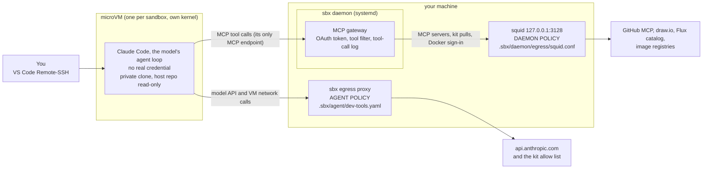
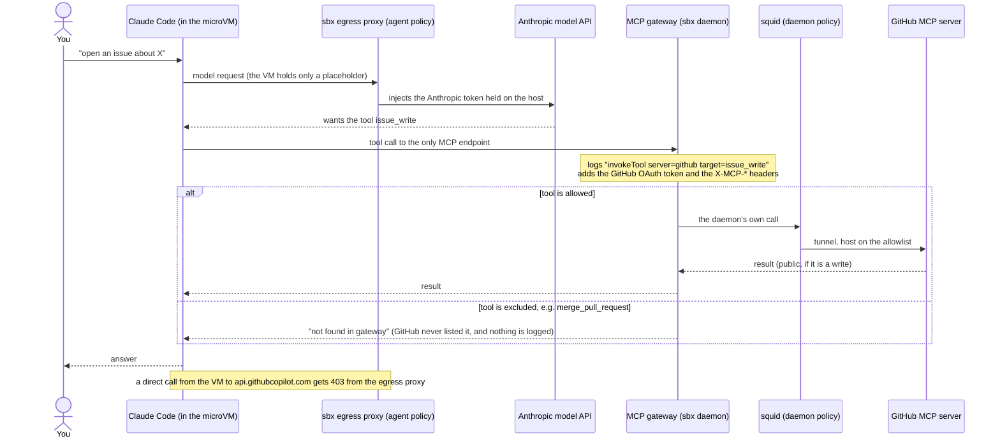
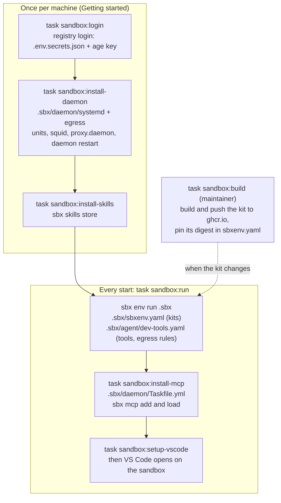

# Part 2.1: sandboxing the dev agent

## The problem

A coding agent that runs on your machine runs as you: it can read what you can read and use what you can use. Anyone who can put text in front
of it can try to steer it, through a GitHub issue, a web page or a tool result, and the agent cannot reliably tell their text from yours.

Earlier parts: [Part 1](../part-1-lethal-trifecta/README.md) shows the attack and [Part 2](../part-2-sandboxing-local-mcp/README.md) contains the MCP server. This part moves the agent itself into a sandbox.

## The solution

Claude Code runs inside an `sbx` microVM, on a private clone of the repo, and holds no real credential. The MCP servers (GitHub, draw.io, the Flux schema catalog) are registered on the host's sbx MCP gateway, so the agent
reaches them only through it. The gateway holds GitHub's OAuth token and sets the tool filter headers where the agent cannot change them.
Every other outbound request goes through an egress allow list, with a deny list on top (both in `.sbx/agent/dev-tools.yaml`).
The sbx daemon runs on the host, outside the VM, and makes the MCP calls and kit pulls itself, so its own outbound calls go through a squid allowlist
that systemd keeps running (`.sbx/daemon/`).

This follows Anthropic's [How we contain Claude across products](https://www.anthropic.com/engineering/how-we-contain-claude) (May 25, 2026): enforce hard limits in the environment (sandbox, egress controls, credentials kept out) instead of relying on the model. The quotes and the layer-by-layer mapping are in the [notes](docs/research/readme-notes.md).

### How it is laid out



| Who controls what | Applies to | Where to change it |
|---|---|---|
| Agent policy: the kit's egress allow and deny lists | what the VM itself connects to | `.sbx/agent/dev-tools.yaml` |
| MCP gateway: OAuth token, tool filter, tool-call log | every MCP call from the agent | `.sbx/daemon/Taskfile.yml` (vars), `task sandbox:install-mcp` |
| Daemon policy: squid allowlist | what the sbx daemon itself connects to (MCP servers, kit pulls, Docker sign-in) | `.sbx/daemon/egress/squid.conf` |

### How it works

One agent turn, with the model, the sandbox and the three control points. Direct routes from the VM to the MCP hosts are denied by the egress proxy.



How `.sbx` sets this up and starts it:



Agent policy is `.sbx/agent/`, daemon policy is `.sbx/daemon/`. Logs: `docker logs sbx-daemon-egress` (daemon side), `sbx policy log` (VM hosts), `sandboxd/mcp/mcp.log` (tool calls).
How the daemon side fits together: [`.sbx/daemon/README.md`](../../../.sbx/daemon/README.md).

## Prerequisites

Have these in place before the first command in [Getting started](#getting-started).

1. **Host tools.** [mise](https://mise.jdx.dev) (installs `task`, `yq`, `jq` and `sops` from the root `mise.toml`), VS Code, and Docker (to build the kit).
2. **sbx.** Follow Docker's [install guide](https://docs.docker.com/ai/sandboxes/install/) for the requirements (virtualization, `/dev/kvm`, sign-in, disk) and run `sbx diagnose`.
   On Ubuntu 24.04 or later:

   ```shell
   curl -fsSL https://get.docker.com | sudo REPO_ONLY=1 sh
   sudo apt install docker-sbx
   ```

   On other distributions, use the tarball from [github.com/docker/sbx-releases](https://github.com/docker/sbx-releases). That is not a Docker-supported setup; this repo was built that way on Omarchy (Arch-based). When sbx asks for a default network policy, choose **Balanced**: the kit's allow and deny lists are applied on top.
3. **Rootless Docker as a user service, and linger.** The daemon's proxy runs in it and user services must start at boot.
   See [`code/rootless-docker`](../../rootless-docker). Check:

   ```shell
   systemctl --user is-enabled docker.service     # enabled
   loginctl show-user "$USER" -p Linger           # Linger=yes
   ```

4. **A GitHub App** (`mcp-gh-local`), set up once in GitHub. The agent's GitHub access is this App's OAuth token, held by the gateway, never in the VM.
   - Install it on only the repository the agent needs, with only the permissions it needs (today: contents, issues, pull requests: write; no administration).
   - Add the callback URL `http://127.0.0.1:8765/callback`, turn on **Expire user authorization tokens**, and generate a client secret.
   - Its client id is in `.sbx/daemon/Taskfile.yml` (not a secret). The App's private key is not used.
5. **Secrets.** Two live in the sops-encrypted `.env.secrets.json` at the repo root; edit it with `sops .env.secrets.json`.

   | Secret | Stored in | Used by |
   |---|---|---|
   | `GITHUB_TOKEN`, a token for the ghcr.io kit image | `.env.secrets.json` | `task sandbox:login`, once |
   | `GITHUB_APP_CLIENT_SECRET`, the App's client secret | `.env.secrets.json` | `task sandbox:install-mcp`, piped into sbx's secret store, never printed |
   | GitHub's OAuth token | sbx's host credential store, created by the browser consent | the gateway; never inside the VM |
   | your age key (decrypts the file) | `~/.config/sops/age/keys.txt` | `sops` |

## Getting started

Run these in order, from the repo root.

1. Install the host tools, and activate mise in your shell so `task` is on the PATH (add the `eval` line to your shell rc to keep it; a new shell needs it too):

   ```shell
   mise trust && mise install
   eval "$(mise activate bash)"      # zsh: eval "$(mise activate zsh)"
   task --list                       # the sandbox:* tasks appear when you are in the repo root
   ```

2. Set sbx once:

   ```shell
   sbx settings set kit.allowedSources '["docker.io/","ghcr.io/raghav19/dev-agent-sandbox"]'
   sbx settings set ssh.agentForwardingEnabled false    # do not forward your SSH agent into the sandbox
   ```

3. Log in to the registry (reads `GITHUB_TOKEN`, needs your age key):

   ```shell
   task sandbox:login
   ```

4. Set up the daemon's proxy and units on the host. This restarts the sbx daemon, so do it before you start a sandbox. How the parts fit:
   [`.sbx/daemon/README.md`](../../../.sbx/daemon/README.md). The steps, checks, logs and undo are the comments above `sandbox:install-daemon` in `.sbx/daemon/Taskfile.yml`.
   The daemon unit runs `~/.docker/sbx/bin/sbx`: if `command -v sbx` prints another path, change `ExecStart` in `.sbx/daemon/systemd/sbx-daemon.service` to it first.

   ```shell
   task sandbox:install-daemon
   ```

5. Install the agent skills:

   ```shell
   task sandbox:install-skills
   ```

6. Connect VS Code:

   ```shell
   sbx setup ssh
   code --install-extension ms-vscode-remote.remote-ssh
   ```

7. Start the sandbox. Commit first: only committed files are in the clone.

   ```shell
   task sandbox:run
   ```

   The first time, sbx shows its plan and asks you to approve it. Run Claude Code in the VS Code terminal: it runs inside the sandbox. Run the task again
to reopen the window. The first run also opens a browser once for GitHub's consent. Run Claude Code in the VS Code terminal: it runs inside the sandbox.

Day to day: run `task sandbox:run` again to reopen the window. `task sandbox:build` (maintainer) rebuilds and pushes the tools image, `task sandbox:update-skills`
refreshes the skills. Egress rules for the VM live in the kit image, so after changing them run `task sandbox:build` and create a new sandbox.

## Reference

### Directory structure

```text
.sbx/                               everything that spawns the sandbox
├── Taskfile.yml                    orchestration: sandbox:login and sandbox:run (the ordered start); includes the two folders below
├── sbxenv.yaml                     the sandbox: kits, size, clone workspace
├── agent/                          AGENT POLICY: what runs inside the VM
│   ├── Taskfile.yml                sandbox:build, :install-skills, :update-skills, :setup-vscode
│   ├── dev-tools.yaml              the kit: tools, completions, shell, egress allow and deny lists (+ its .dockerignore)
│   └── tools.toml                  the sandbox's tools at exact versions, Terraform cache settings, the completions task
└── daemon/                         DAEMON POLICY: what the sbx daemon and its MCP gateway may reach
    ├── README.md                   what is set up on the host and how (read first: it is a prerequisite for the tasks)
    ├── Taskfile.yml                sandbox:install-daemon (once per machine), sandbox:install-mcp
    ├── systemd/                    the two user units: the proxy and the sbx daemon (installed by sandbox:install-daemon)
    └── egress/
        ├── compose.yaml            squid for the daemon on 127.0.0.1:3128
        └── squid.conf              the allowlist: the one file to edit to change what the daemon may reach
```

This folder keeps the README, `docs/` and the handoffs.

Repo-root files (`Taskfile.yml`, `mise.toml`, `.env.secrets.json`, `.vscode/`, `AGENTS.md`) and the host paths are listed in the [notes](docs/research/readme-notes.md).

### Getting the agent's work

The agent works on a private clone inside the VM, so nothing it does changes your working tree until you bring it over.
Your IDE sees changes only after you fetch and merge or check out. Only committed work comes over, so ask the agent to
commit on a branch.

```shell
git fetch sandbox-sandbox-dev                               # its branches show up as remote branches in your IDE's Git view
git worktree add ../review sandbox-sandbox-dev/<branch>     # review in a separate folder; your working tree is untouched
git merge --ff-only sandbox-sandbox-dev/<branch>            # or bring it into your working tree
```

Fetch again after the agent commits more. Before `sbx rm`, keep what you want with
`git branch review sandbox-sandbox-dev/<branch>`: removing the sandbox also removes the remote and its fetched branches.

### Threats and what stops them

✅ stopped · ⚠️ partly (gap in brackets) · ❌ not stopped. Rows are grouped by the layers in Anthropic's
[How we contain Claude](https://www.anthropic.com/engineering/how-we-contain-claude): environment, model, external
content, plus monitoring. The Part 2.1 column was checked against a running sandbox on 2026-10-08 and its classification reviewed on 2026-10-09
([evidence](docs/research/threat-table-verification.md)). The Part 2 column was audited on 2026-10-06. Egress is enforced here with allow and deny rules and proxies, not CEL or Cedar policies; the model side is left to Part 3.

| Layer | Threat | Part 2: container + proxy | Part 2.1: microVM |
|---|---|---|---|
| Environment | Compromised MCP server code | ✅ | ⚠️ (no MCP code runs locally; the hosted servers are trusted) |
| Environment | Data leaving the sandbox | ✅ explicit allow-list | ⚠️ (gap: 194 baseline allow rules; two allowed hosts accepted a body in testing; the daemon's own calls are on a squid allowlist) |
| Environment | Credentials stolen | ⚠️ (gap: key inside the container) | ✅ only placeholders in the VM (`GH_TOKEN` returns 401) |
| Environment | Credential used outside its purpose | ⚠️ (gap: the server holds the key) | ✅ the token stays in the gateway and the direct route is 403; what it may do is covered by the two MCP rows below |
| Environment | Files that run on your host (merged `.sbx/`, Taskfiles) | ❌ | ✅ merge review is the gate, as with a devcontainer; read `.sbx/` diffs like any host-run script |
| Environment | Host files the agent can read | ❌ | ✅ clone mode: edits stay in the clone and only the repo directory is visible, read-only; untracked and ignored files there are readable, so keep plaintext secrets out |
| Environment | Tampered images or scripts | ✅ | ⚠️ (kit and squid image pinned by digest, not signed: `kit.requireSignature` is off) |
| Model | Injected instructions | ❌ | ❌ not a sandbox control (Part 1's two refusals were the model) |
| External content | Destructive tools (delete, merge, push to `main`) | ❌ | ✅ delete, merge and repo create, fork and delete are filtered out at the gateway; the writes that remain create or edit branches, PRs, issues and comments, all reversible. Relies on branch protection on `main` (pull request and one approval required), which is a GitHub setting, not the sandbox |
| External content | Publishing data through MCP writes | ❌ | ⚠️ (by design the agent writes to the one repo the App covers; if that repo is public, whatever it writes is public. In testing it published an untracked file to a public issue. An allow list narrows it) |
| External content | Poisoned tool results | ❌ | ❌ |
| External content | Instructions that persist across sessions (`AGENTS.md`, memory, session history) | ❌ | ⚠️ (gap: the VM keeps its files across stop and start until `sbx rm`; changes to `AGENTS.md` reach the host only through a reviewed merge) |
| Monitoring | Record of what the agent did | ⚠️ (gap: hosts only) | ⚠️ (allowed and blocked hosts: `sbx policy log`; allowed tool calls by name: `mcp.log`; the daemon's hosts: `docker logs sbx-daemon-egress`. Gap: no central log, rejected tool calls and arguments are not recorded) |

Out of scope for every part: a VM or container escape, tool descriptions that lie, a compromised GitHub or model
provider.

#### The lethal trifecta: what the sandbox contains

The trifecta is private data, untrusted content and a way to send data out, all in one agent. Tested on 2026-10-08 with canary strings and a canary GitHub issue
([details](docs/research/threat-table-verification.md)). The sandbox shrinks it; it does not break it.

| Leg | What the sandbox does | What remains |
|---|---|---|
| Private data | Your home, `~/.ssh`, `~/.aws` and every real credential are out of reach. Clone mode keeps the agent on the repo, which it needs. | The repo directory, including untracked and ignored files, is readable (accepted by design: keep plaintext secrets out of it). |
| Untrusted content | Nothing. | Issues, tool results and pages reach the agent as before; the model side is Part 3. |
| A way out | Direct routes to the MCP servers and the GitHub API are blocked (403/401). | MCP writes reach the one repo the App covers. If it is public, what the agent writes there is public: in testing it published an untracked file to a public issue (the worst case). Two policy-allowed hosts also accepted a body. |

So the sandbox limits the **blast radius**, and the channel left open is the GitHub write tools, by design scoped to one repo. To narrow it: allow-list the tools (`X-MCP-Tools`) or run
read-only (`X-MCP-Readonly`), and log rejected calls (Part 3).

#### Notes

- **Clone mode:** the agent works on a private clone and the host repo is read-only; only committed files are in the clone, untracked ones stay readable.
- **Sandbox remote:** the agent's commits are served read-only at `sandbox-<name>` on 127.0.0.1; review before you merge.
- **MCP gateway:** GitHub, draw.io and Flux are registered on the host gateway; the VM has no direct route to them (403).
- **Tool filter:** GitHub omits excluded tools; the gateway sets the headers (`.sbx/daemon/Taskfile.yml`); an allow list (`X-MCP-Tools`) is stricter.
- **Logs:** allowed and blocked hosts in `sbx policy log`, allowed tool calls by name in `sandboxd/mcp/mcp.log`, the daemon's hosts in `docker logs sbx-daemon-egress`; rejected tool calls and arguments are not logged.
- **GitHub auth:** the App's OAuth flow, refreshed by sbx; the token is limited to the App's permissions on the installed repo.
- **Daemon proxy:** the daemon's own calls go through squid (`proxy.daemon`, experimental) and fail closed; see `.sbx/daemon/README.md`.
- **Dynamic MCP mode:** `sbx env run` has no `--static-mcp`, so the agent can attach any server registered on the host.
- **App permissions are the boundary:** contents, issues and pull requests (write), no administration, one repository. `main` is protected: a pull request and one approval are required.

## What is left ahead

- **Part 3, a gateway with rules:**
  - per-tool rules: sbx's own (Cedar) need a paid Docker org subscription; a gateway of your own can limit tools by name, repo and user;
  - arguments: look at them and log every call, including rejected ones (today: allowed calls by name only);
  - per-repo write limits and an allow-list or read-only GitHub for sessions that only need to read.
- **Smaller gaps from the threat table:** `.env`, `*.pem` and `*.tfstate` in `.gitignore` (and out of the repo directory); signed kits (`kit.requireSignature`); a tighter baseline for S3.
