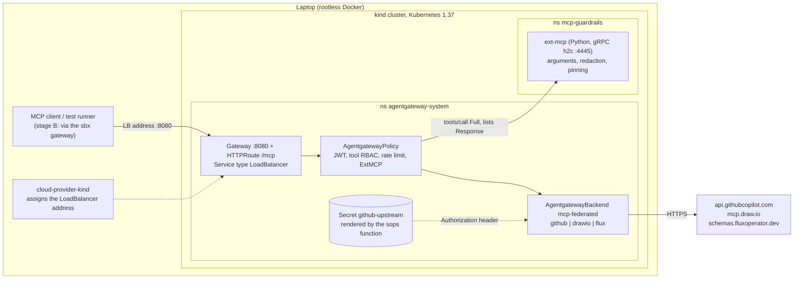
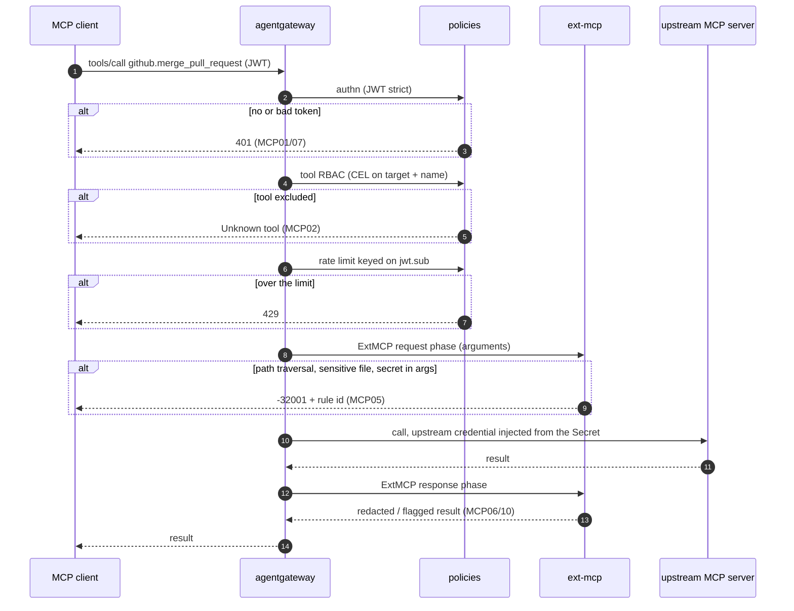
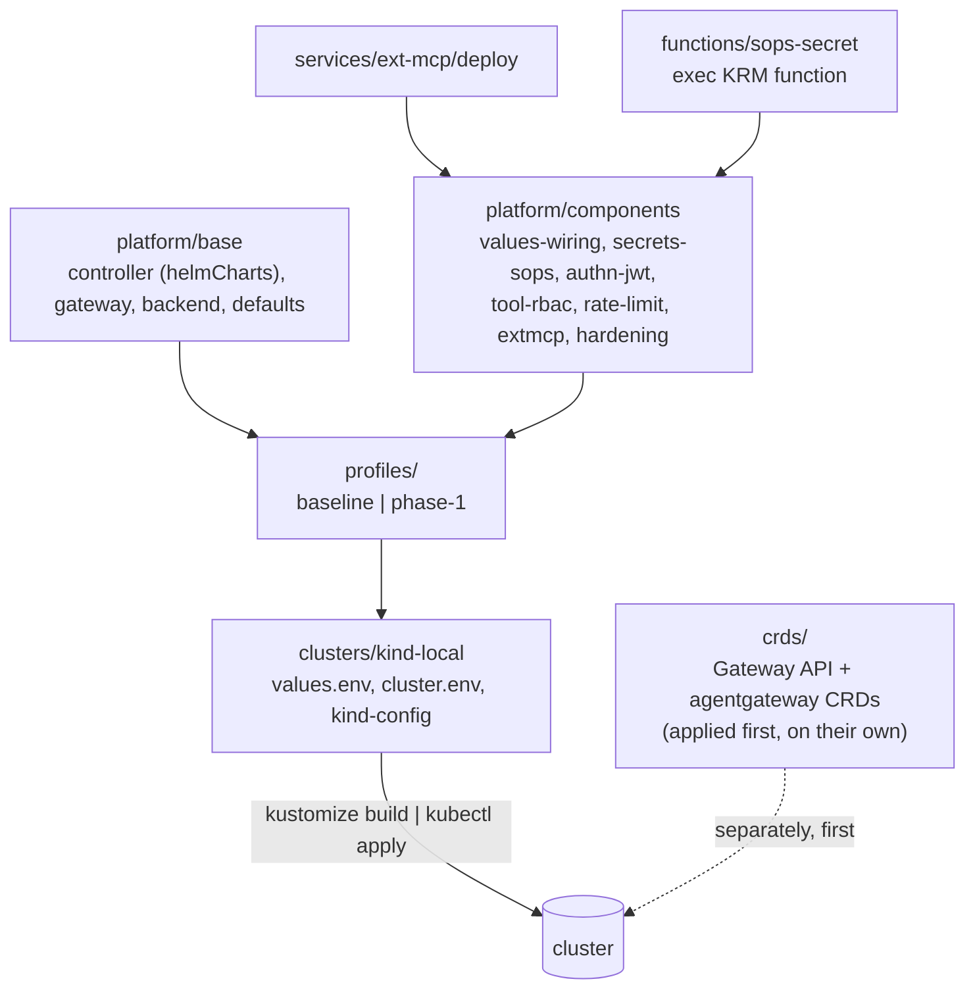
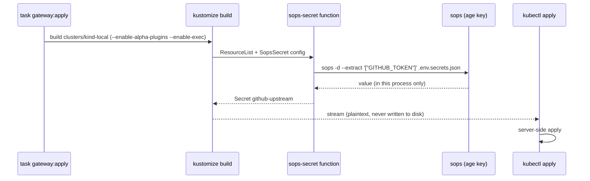

# Part 3: MCP guardrails with agentgateway on kind

Part 1 showed the attack. Part 2 contained one local MCP server. [agent-sandbox](../../agent-sandbox/README.md) put the agent in a microVM. This part puts a **policy point on the MCP path**: every call to a remote MCP server goes through [agentgateway](https://agentgateway.dev) running in a local kind cluster, where tool, argument and response rules apply, mapped to the [OWASP MCP Top 10](https://owasp.org/www-project-mcp-top-10/).

> **Status (foundation, stage A).** Manifests, CRD layer, secrets function, profiles, Taskfile, ext-mcp rules and two attack cases are written and **render offline** (`kustomize build`, phase-1 verified with a shimmed `sops`). **Not yet run against a cluster**: kind and cloud-provider-kind were not available where this was written, and the rootless-Docker LoadBalancer question below is the first thing to prove. Stage B (chaining the sbx gateway to this one, sandbox-driven tests, Keycloak) follows a spike.

## What this builds

- **A gateway in front of three remote MCP servers**: GitHub, draw.io and the Flux schema catalog, federated behind one `/mcp` endpoint with target-prefixed tool names.
- **Two profiles you can compare**: `baseline` (gateway in path, nothing enforced) and `phase-1` (every guardrail on). Same attacks, two results.
- **Declarative end to end**: kustomize only. Values through `configMapGenerator` + `replacements`, charts through kustomize's Helm support, secrets through an exec KRM function over the repo's sops file. Taskfile only orchestrates.

## Architecture



## One request, step by step



## How the manifests are composed



### How a secret gets in



The agent never holds this value. The gateway reads it from the Secret and sets the upstream `Authorization` header.

## Directory structure

```text
part-3-mcp-guardrails/
├── README.md
├── research.md                  background research (versions there predate the pins below)
├── Taskfile.yml                 orchestration only, driven by CLUSTER= (default kind-local)
├── tasks/kind.yml               provider tasks (an eks.yml is added per provider)
├── crds/                        installed separately, first: gateway-api/ and agentgateway/
├── platform/
│   ├── base/                    namespaces, controller (helmCharts), gateway, backend, defaults
│   └── components/              values-wiring, secrets-sops, authn-jwt, tool-rbac, rate-limit, extmcp, hardening
├── profiles/                    baseline, phase-1: which guardrails are on (no region/env data)
├── clusters/
│   ├── kind-local/              cluster.env, kustomization.yaml, values.env, kind-config.yaml, patches/
│   └── _example-eks/            template for a second cluster
├── functions/sops-secret/       exec KRM function over .env.secrets.json
├── services/ext-mcp/            rules.py (+ tests), Dockerfile, deploy/ (kustomization)
└── tests/
    ├── attacks/                 one folder per OWASP id: run.sh, driven by lib.sh
    └── servers/evil-mcp/        fixture server (stub)
```

Adding a cluster (for example EKS in a region) is a new folder under `clusters/` plus `tasks/<provider>.yml`; see [`clusters/_example-eks`](clusters/_example-eks/README.md). `crds/`, `platform/`, `profiles/` and `services/` do not change. To change guardrails, change the one profile line in the cluster's `kustomization.yaml`; to change a value, edit that cluster's `values.env`.

## Versions

Latest stable at 2026-10-10, checked against the GitHub release APIs, for Kubernetes **1.37**:

| Component | Pin | Where |
|---|---|---|
| Kubernetes (kind node image) | `v1.37.0@sha256:a1ed56cf…` (kind v0.33.0 default) | `clusters/kind-local/kind-config.yaml` |
| kind | 0.33.0 | root `mise.toml` |
| cloud-provider-kind | 0.12.0 | root `mise.toml` |
| Gateway API (experimental channel) | v1.6.3 | `crds/gateway-api/` |
| agentgateway (CRDs and controller) | v1.6.0 | `crds/agentgateway/`, `platform/base/controller/` |
| kubectl / kustomize / helm | 1.37 / 5.8.3 / 4.3.0 | root `mise.toml` |

agentgateway v1.6.0 lists Kubernetes 1.32 to 1.37 and Gateway API 1.4 to 1.6 as supported ([research.md](research.md)). Bump a CRD version in `crds/` and the matching controller version together.

## Getting started

Prerequisites: rootless Docker as in [`code/rootless-docker`](../../rootless-docker), `mise install` at the repo root, and your age key for `sops`.

1. **Upstream credential.** The gateway uses the existing `GITHUB_TOKEN` from `.env.secrets.json` (`platform/components/secrets-sops/sops-secret.yaml`). Check on the host that it can call the GitHub MCP server (`tools/list` in step 6 returns the `github_*` tools). It was created for pulling the kit image, so if it lacks the repo permissions you need, add a dedicated key (for example `GITHUB_MCP_PAT`, a fine-grained PAT on the one repo) and change the mapping in that file.
2. **Create the cluster.** `task cluster:up`.
3. **Start the LoadBalancer provider** in a second terminal and leave it running: `task cluster:lb`.
4. **Install the CRDs on their own.** `task crds:apply`.
5. **Apply the platform.** `task gateway:apply` (profile `baseline`).
6. **Find the address.** `task gateway:address`, then check `tools/list` with the MCP Inspector against `http://<address>:8080/mcp`.
7. **Run the attacks on baseline**, then switch the profile line in `clusters/kind-local/kustomization.yaml` to `../../profiles/phase-1`, run `task gateway:apply` again and re-run: `task tests:run`.
8. **Tear down.** `task cluster:down`.

Every task refuses to run unless `kubectl`'s current context is the one named in `cluster.env`.

## Guardrails and what they map to

| Control | Component | OWASP MCP | Test |
|---|---|---|---|
| JWT, strict | `authn-jwt` | MCP01, MCP07 | `MCP07-no-token` |
| Upstream credential held by the gateway | `secrets-sops` + backend `auth.secretRef` | MCP01 | (inspect: nothing client-side) |
| Tool deny list (CEL, target + name) | `tool-rbac` | MCP02 | `MCP02-destructive-tool` |
| Rate limit per `jwt.sub` | `rate-limit` | MCP02, MCP10 | to write |
| Argument and response checks, pinning | `extmcp` + `services/ext-mcp` | MCP03, 05, 06, 10 | `rules.py` unit tests; attack cases to write |
| Only the gateway may call ext-mcp | `hardening` | MCP04, MCP09 | to write |
| Access logs and traces | not wired | MCP08 | to write |

MCP04 (supply chain) and MCP06 (intent flow subversion) are reduced here, not solved.

## Known gaps and open risks

- **LoadBalancer reachability on rootless Docker is unproven.** The LB proxy's IP lives inside rootlesskit's network namespace and may not route from the host. cloud-provider-kind 0.12.0 adds `--enable-lb-port-mapping` and `--enable-lb-tunnel`; `task cluster:lb` runs it with `--gateway-channel disabled` so it does not install its own Gateway API CRDs. First thing to try on the real machine.
- Both OCI Helm charts now render offline (`kustomize build --enable-helm`): 17 CRDs plus the Gateway API safe-upgrades admission policy, and the controller.
- **`GITHUB_TOKEN` as the MCP credential is untested**: it could not be decrypted where this was written, so its permissions against the GitHub MCP server are unknown.
- **Not verified against a live controller**: the CRD field names are checked against the v1.6.0 schemas, but `Gateway` Programmed status, the secret key convention (`Authorization`, raw token) and how two `AgentgatewayPolicy` objects on one backend merge need a cluster.
- **JWKS is a placeholder** (`{"keys":[]}` in `authn-jwt`) until a key is minted; Keycloak replaces it in stage B.
- **ext-mcp has rules but no server yet**: the gRPC contract is to be vendored at the pinned tag.
- Argument-level CEL is unreliable in agentgateway ([#3092](https://github.com/agentgateway/agentgateway/issues/3092)), which is why argument checks live in ext-mcp.
- Exec KRM functions run with your privileges; the one here is 40 lines and in this repo. Kustomize has no built-in sops support.
