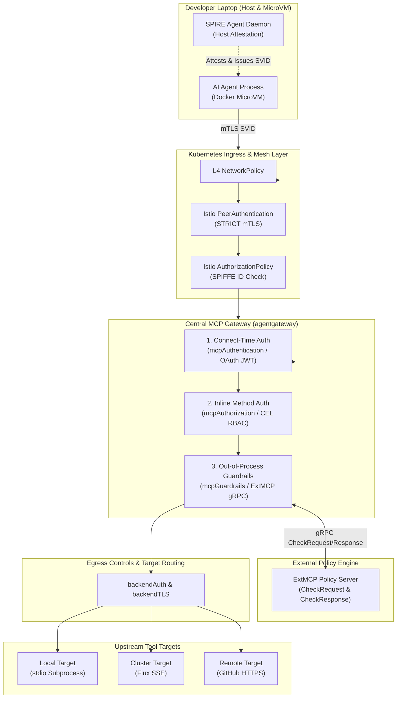

```mermaid
flowchart TD
    subgraph Laptop["Developer Laptop (Host & MicroVM)"]
        Agent["AI Agent Process\n(Docker MicroVM)"]
        SPIREAgent["SPIRE Agent Daemon\n(Host Attestation)"]
    end

    subgraph Mesh["Kubernetes Ingress & Mesh Layer"]
        L4Net["L4 NetworkPolicy"]
        PeerAuth["Istio PeerAuthentication\n(STRICT mTLS)"]
        AuthzPol["Istio AuthorizationPolicy\n(SPIFFE ID Check)"]
    end

    subgraph Gateway["Central MCP Gateway (agentgateway)"]
        Phase1["1. Connect-Time Auth\n(mcpAuthentication / OAuth JWT)"]
        Phase2["2. Inline Method Auth\n(mcpAuthorization / CEL RBAC)"]
        Phase3["3. Out-of-Process Guardrails\n(mcpGuardrails / ExtMCP gRPC)"]
    end

    subgraph ExtMCP["External Policy Engine"]
        PolicyServer["ExtMCP Policy Server\n(CheckRequest & CheckResponse)"]
    end

    subgraph Egress["Egress Controls & Target Routing"]
        EgressPolicy["backendAuth & backendTLS"]
    end

    subgraph Targets["Upstream Tool Targets"]
        StdioTool["Local Target\n(stdio Subprocess)"]
        FluxTool["Cluster Target\n(Flux SSE)"]
        GitHubTool["Remote Target\n(GitHub HTTPS)"]
    end

    Agent -->|mTLS SVID| Mesh
    SPIREAgent -.->|Attests & Issues SVID| Agent
    Mesh --> L4Net --> PeerAuth --> AuthzPol --> Gateway
    Gateway --> Phase1 --> Phase2 --> Phase3
    Phase3 <-->|gRPC CheckRequest/Response| PolicyServer
    Phase3 --> EgressPolicy
    EgressPolicy --> StdioTool
    EgressPolicy --> FluxTool
    EgressPolicy --> GitHubTool
```